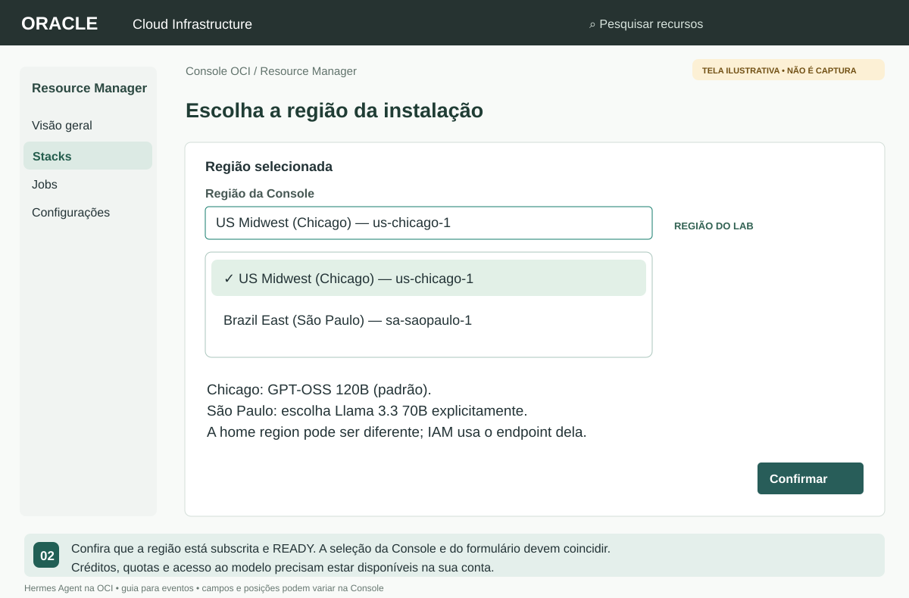
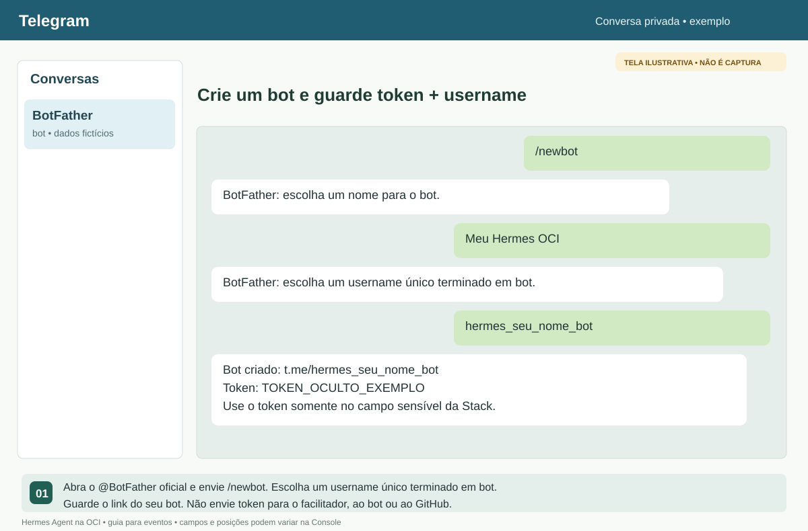
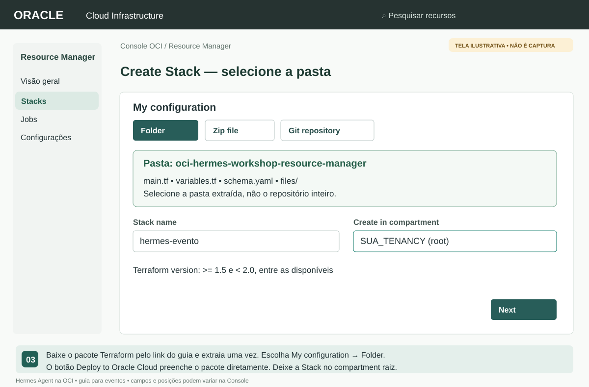
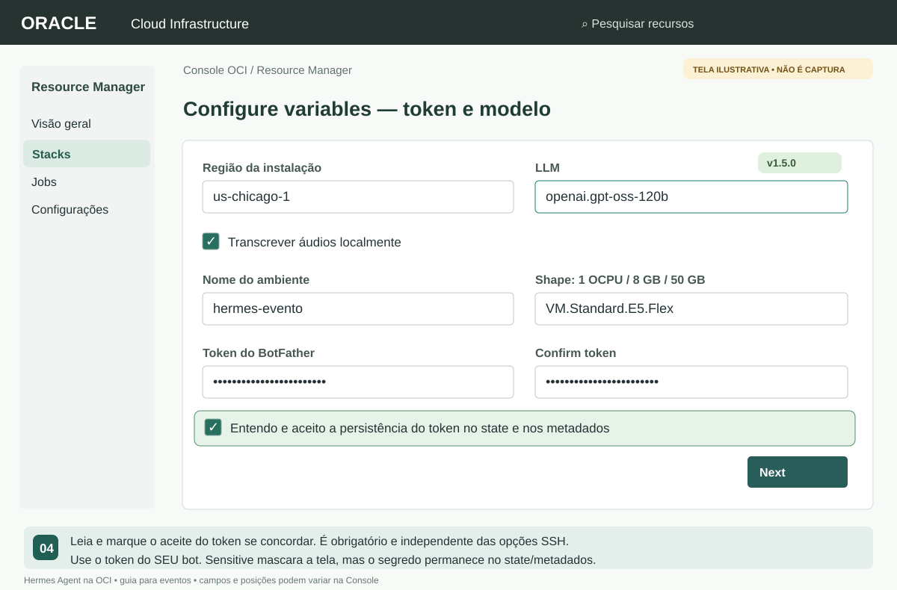
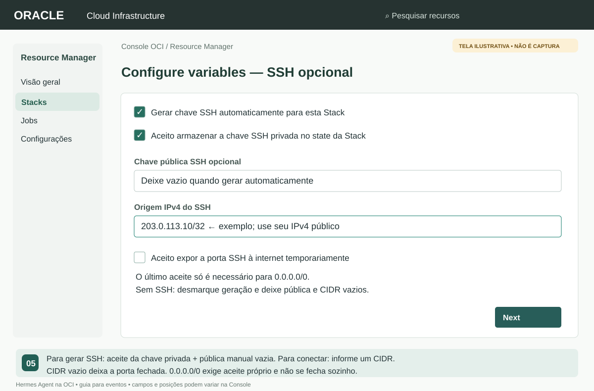
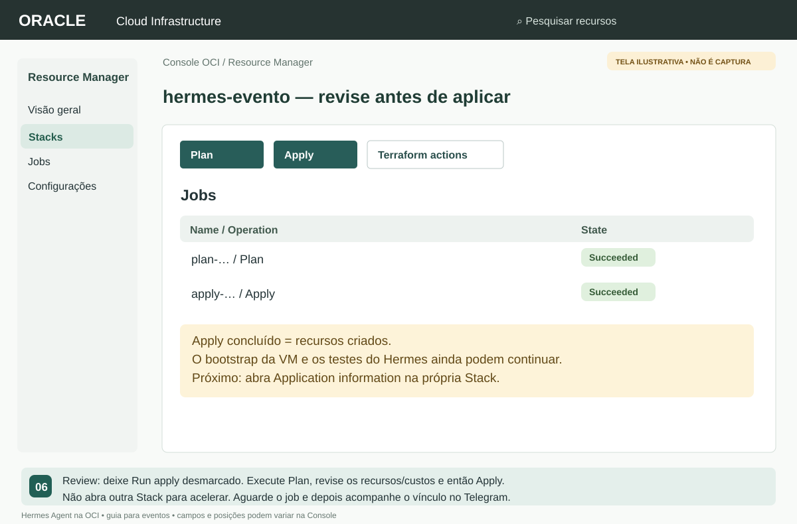
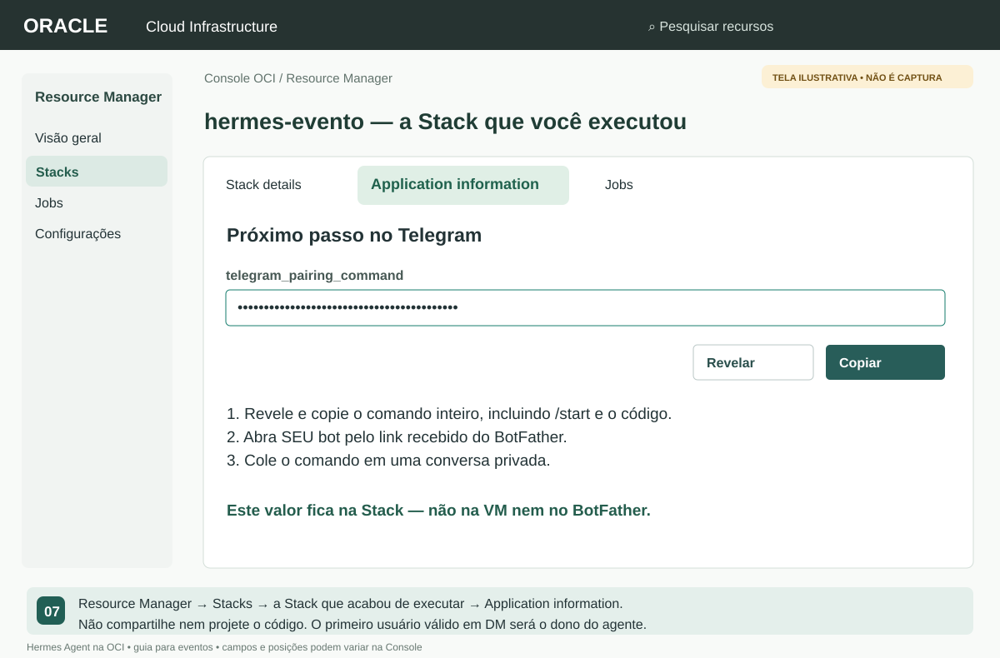
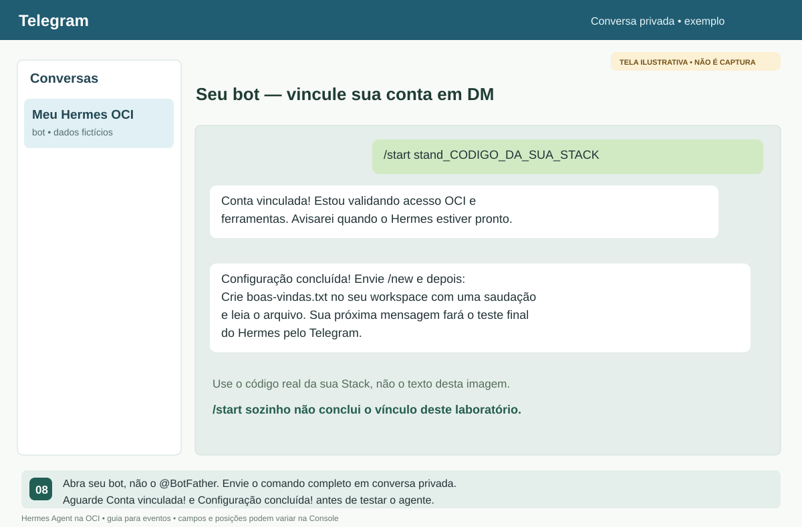
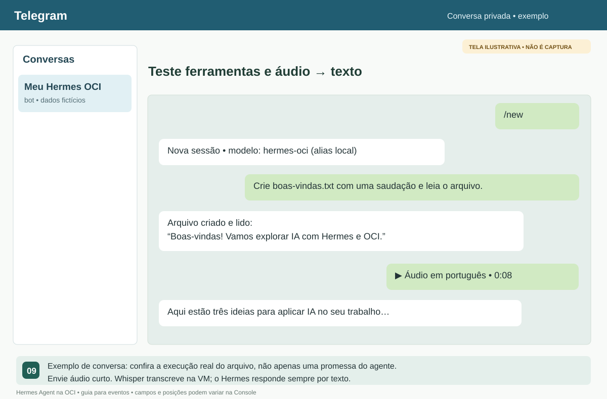
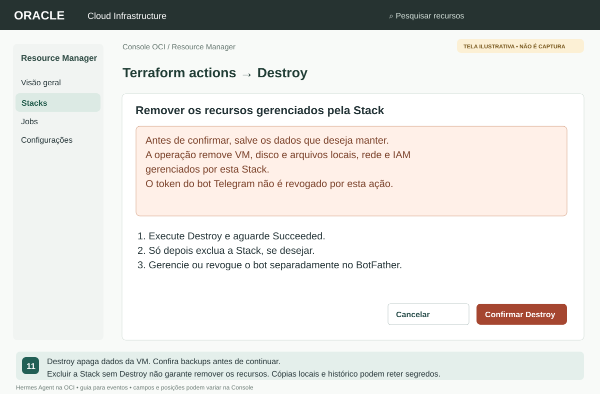

# Hermes Agent na OCI, pelo Telegram

Seu agente pessoal em uma VM OCI: converse por texto, envie áudios e execute
tarefas com ferramentas. Um laboratório para **workshops, conferências,
meetups, treinamentos e experiências práticas em eventos**.

**Console OCI → Terraform → Hermes → Telegram.** Não precisa instalar
Terraform no computador, abrir Cloud Shell ou usar SSH para concluir a instalação.

[](https://cloud.oracle.com/resourcemanager/stacks/create?zipUrl=https%3A%2F%2Fgithub.com%2Frafaelrdias%2Foci-hermes-workshop%2Farchive%2Frefs%2Fheads%2Fresource-manager.zip)

[Começar pela Console](https://cloud.oracle.com/resourcemanager/stacks/create?zipUrl=https%3A%2F%2Fgithub.com%2Frafaelrdias%2Foci-hermes-workshop%2Farchive%2Frefs%2Fheads%2Fresource-manager.zip)
· [Baixar pasta Terraform](https://github.com/rafaelrdias/oci-hermes-workshop/archive/refs/heads/resource-manager.zip)
· [Acesso SSH](docs/SSH.md) · [Resolver problemas](docs/OPERACAO.md)

## O que será instalado

| Componente | Configuração |
|---|---|
| Agente | Hermes Agent: terminal, arquivos, memória e skills |
| Modelo padrão | GPT-OSS 120B (`openai.gpt-oss-120b`), OCI Generative AI on-demand em Chicago |
| Canal | Telegram privado, vinculado ao próprio participante |
| Áudio recebido | Whisper base local na CPU; sem API paga de transcrição |
| Respostas | Sempre por texto |
| Infraestrutura | Compartment, rede, VM Oracle Linux, Dynamic Group e policy automáticos |
| SSH | Opcional; geração automática de chave ou chave pública própria |

Cada participante usa **sua própria conta OCI e um bot exclusivo**. A VM padrão
tem 1 OCPU, 8 GB de RAM e 50 GB de disco. VM, disco e inferência podem consumir
créditos/cobrança: transcrição local não significa laboratório inteiro gratuito.

> **Segurança:** o token Telegram persiste nas variáveis/state da Stack e nos
> metadados de instalação da VM. Se gerar SSH, a chave privada também fica no
> state e em uma saída sensível. `sensitive` mascara a exibição, não remove o
> segredo. Restrinja acesso à Stack, jobs e VM; não compartilhe tokens, comandos
> de pareamento ou chaves. O formulário exige os aceites correspondentes.

> **Sobre as telas:** as imagens deste guia são **telas ilustrativas**, com
> dados fictícios e foco nos campos usados. Não são capturas de uma conta real.
> Posição/idioma dos controles podem variar. Use seu token e as saídas da sua Stack,
> nunca os valores fictícios das imagens.

## 1. Prepare a conta e selecione Chicago

1. Ative seu [Trial OCI](https://www.oracle.com/cloud/free/) antes da atividade e
   entre na [Console OCI](https://cloud.oracle.com/) com permissão para criar
   Compute, rede, compartments, Dynamic Groups e policies.
2. No seletor superior, escolha **US Midwest (Chicago)** — **`us-chicago-1`**.
   A região precisa estar subscrita e pronta.
3. Confirme créditos, capacidade de Compute e acesso a Generative AI on-demand.
   O Terraform não aprova cadastro, amplia quotas ou converte a conta em paga.



A **home region pode ser diferente**. IAM é global e o Terraform usa o endpoint
da home region para criá-lo; VM, rede e inferência ficam na região da instalação.
Se o Trial só permite **São Paulo (`sa-saopaulo-1`)**, selecione explicitamente
**Llama 3.3 70B** no formulário. Este pacote não oferece GPT-OSS/Grok on-demand
em GRU nem cria cluster dedicado como alternativa automática.

Grok é uma opção explícita no formulário em ORD, mas seus modelos são hospedados
externamente pela xAI: escolher a região OCI não significa processamento
exclusivamente dentro dela. Veja as [notas de chamadas externas da OCI](https://docs.oracle.com/en-us/iaas/Content/generative-ai/model-endpoint-regions.htm#xai-models).

## 2. Crie seu bot no Telegram

1. Abra o [@BotFather oficial](https://t.me/BotFather) e toque **Start / Iniciar**.
2. Envie **`/newbot`**.
3. Informe um nome, por exemplo **Meu Hermes OCI**.
4. Escolha um username único terminado em **`bot`**. Se estiver ocupado, escolha outro.
5. Guarde o **token** retornado e o link **`https://t.me/SEU_USERNAME_BOT`**.
   O token vai somente no campo sensível `telegram_bot_token` da sua Stack.



Não envie o token ao facilitador, ao próprio bot ou ao GitHub. Use um bot exclusivo.
**Não precisa descobrir chat ID nem criar API key OCI:** o vínculo identifica
seu usuário, e a VM acessa o modelo com Instance Principals.

## 3. Abra Create Stack na Console OCI

### Pelo botão de implantação

Clique em [Começar pela Console](https://cloud.oracle.com/resourcemanager/stacks/create?zipUrl=https%3A%2F%2Fgithub.com%2Frafaelrdias%2Foci-hermes-workshop%2Farchive%2Frefs%2Fheads%2Fresource-manager.zip).
O pacote Terraform é selecionado automaticamente. Confira a região antes de avançar.

### Pela pasta, sem comandos

1. [Baixe a pasta Terraform](https://github.com/rafaelrdias/oci-hermes-workshop/archive/refs/heads/resource-manager.zip).
   O GitHub a transporta em ZIP: **extraia uma vez**.
2. Abra **Developer Services → Resource Manager → Stacks → Create Stack**.
   Também pode pesquisar **Resource Manager** na busca da Console.
3. Em **My configuration → Folder**, selecione a pasta extraída
   **`oci-hermes-workshop-resource-manager`**, onde estão `main.tf` e `schema.yaml`.
4. Não selecione o repositório inteiro nem uma pasta com `.terraform`.
   O pacote leve não inclui imagens ou binários de providers.



Em **Stack information**, use o nome `hermes-evento` e coloque **a Stack no
compartimento raiz** da tenancy, não no compartment que ela criará.
Selecione Terraform **>= 1.5 e < 2.0** entre as versões oferecidas e clique **Next**.
`tenancy_ocid` é preenchido pela Console; o compartment da VM será criado automaticamente.

## 4. Preencha as variáveis e os aceites

Em **Configure variables**, confira **versão 1.5.0**:

| Campo | Como preencher |
|---|---|
| Região da instalação | `us-chicago-1` |
| LLM | `openai.gpt-oss-120b` |
| Transcrever áudios localmente | Marcado |
| Nome do ambiente | `hermes-evento`, ou outro nome exclusivo |
| Token do BotFather | Seu token no campo mascarado e na confirmação |
| Aceite de persistência do token | Leia e marque se concordar; obrigatório |
| Shape | E5.Flex padrão: 1 OCPU / 8 GB / 50 GB; consome créditos |
| Availability domain | `0` para o primeiro AD; outro índice somente se disponível |



**São três aceites distintos:** token no state/metadados (sempre), chave privada
SSH no state (se gerar SSH) e SSH público (somente com `0.0.0.0/0`).
Marcar o aceite SSH não marca o do token. Sem aceite obrigatório, o Plan é
bloqueado: corrija em **Edit Stack → Configure variables**.

## 5. Escolha se quer SSH — opcional

Para usar só Telegram, deixe geração desmarcada e chave pública/CIDR vazios.
Para administrar a VM posteriormente:

1. Marque **Gerar chave SSH automaticamente para esta Stack**.
2. Marque o aceite **da chave privada no state** e deixe a pública manual vazia.
3. Deixe **Origem IPv4 do SSH** vazia para manter a porta fechada; a pública já
   será instalada. Para conectar agora, informe seu IPv4 público com `/32`.
4. Para qualquer IPv4 no evento, informe `0.0.0.0/0` e aceite a exposição.
   Qualquer IPv4 poderá tentar conectar; a liberação não expira automaticamente.



Você também pode **não gerar** e fornecer sua chave pública `.pub`. Não escolha
os dois caminhos. A privada nunca deve ser colada como variável.
[Como recuperar a chave e acessar a VM](docs/SSH.md).

## 6. Execute Plan e Apply

1. Em **Review**, deixe **Run apply** desmarcado e clique **Create**.
2. Na Stack, clique **Plan** e aguarde o job **Succeeded**.
3. Revise logs, recursos e custos: uma VM, disco, rede, compartment, DG/policy
   e, se escolhido, par SSH. Não deve haver GPU ou cluster dedicado.
4. Clique **Apply**, selecione o plano revisado quando oferecido e confirme.
   Aguarde **Succeeded**; em caso de falha, confira os logs antes de repetir.



**Apply concluído não significa Hermes pronto.** Ainda pode haver instalação
de dependências, download da transcrição, propagação IAM e testes do agente.
Cadastro, downloads, capacidade e quotas variam: não há prazo fixo garantido.
Não dispare instalações duplicadas para tentar acelerar.

## 7. Vincule sua conta ao bot

1. Abra **Resource Manager → Stacks → a Stack que acabou de executar**.
2. Na página **da Stack**, abra **Application information** — não procure
   essa informação na VM, no BotFather ou apenas nos logs do job.
3. Em **Próximo passo no Telegram**, revele e copie **`telegram_pairing_command`**.



4. Abra **seu bot**, pelo link recebido do BotFather. Toque **Start / Iniciar**
   se necessário e envie **o comando completo copiado**, incluindo o código.
   `/start` sozinho não realiza o vínculo deste laboratório.
5. Aguarde **“Conta vinculada!”** e depois **“Configuração concluída!”**.
   Se enviou antes de o instalador estar ouvindo e não houve confirmação,
   aguarde o bootstrap e reenvie o comando, sem repetir continuamente.



O primeiro usuário que enviar o código válido em DM será o dono autorizado.
Não projete nem compartilhe esse código. Não precisa chat ID ou aprovação SSH.
Em nova Stack, use a nova saída.

## 8. Converse e teste ferramentas e áudio

Depois de **Configuração concluída**, envie **`/new`**, aguarde a confirmação e peça:

```text
Crie boas-vindas.txt no seu workspace com uma saudação e leia o arquivo mostrando o resultado.
```

O agente deve criar, ler e mostrar o conteúdo, não apenas prometer executar.
Depois envie um áudio curto em português pedindo três ideias para aplicar IA
no seu trabalho. A transcrição acontece na VM; a resposta vem **por texto**.



O nome exibido na sessão pode ser **`hermes-oci`**, alias local do modelo.
O modelo OCI selecionado aparece na saída **`model`** da Stack. Não use dados
confidenciais nos exercícios. Veja [diagnóstico](docs/OPERACAO.md) se houver demora ou erro.

## 9. Ao terminar: guardar ou remover

Se continuar usando o agente, acompanhe custo/crédito e restrinja SSH.
Para remover os recursos:

1. Salve os arquivos/memórias desejados e sua chave privada, se necessária.
2. Abra **a própria Stack → Terraform actions → Destroy** (ou ação Destroy).
3. Revise e confirme. **VM, disco, arquivos, histórico, rede e IAM gerenciados
   pela Stack serão removidos.** Aguarde o job **Succeeded**.
4. Só então exclua a Stack, se desejar. Excluir sem Destroy não garante remover
   os recursos. O bot é separado: gerencie/revogue seu token no BotFather.



Históricos de jobs/state e cópias locais podem reter segredos. Destroy não apaga
arquivos baixados nem revoga o token Telegram.

## Para continuar

- [SSH e ajustes do Hermes](docs/SSH.md)
- [Problemas, limites e operação](docs/OPERACAO.md)
- [Arquitetura e segurança](docs/ARQUITETURA.md)
- [Validação e manutenção](docs/MANUTENCAO.md)

O [Hermes Agent](https://github.com/NousResearch/hermes-agent) combina LLM e
ferramentas: o modelo decide ações e o agente as executa. Este ambiente é uma
demonstração pessoal, não um sandbox multiusuário. Terminal/rede podem executar
ações reais; não habilite acesso irrestrito nem use documentos sigilosos.

## Referências

- [OCI Resource Manager](https://docs.oracle.com/en-us/iaas/Content/ResourceManager/home.htm)
- [Modelos Generative AI por região](https://docs.oracle.com/en-us/iaas/Content/generative-ai/model-endpoint-regions.htm)
- [BotFather — documentação Telegram](https://core.telegram.org/bots/features#botfather)
- [Agent Station Experience — referência de organização do guia](https://github.com/MachadoAmanda/oracle/tree/main/Agent%20Station%20Experience)
