# Hermes Agent na OCI, pelo Telegram

Seu agente pessoal em uma VM OCI: converse por texto, envie áudios e execute
tarefas com ferramentas.

**Console OCI → Terraform → Hermes → Telegram.** Não precisa instalar
Terraform no computador, abrir Cloud Shell ou usar SSH para concluir a instalação.

## Comece por aqui

**Mantenha este guia aberto até a primeira conversa com o Hermes.** A Console
executa a instalação, mas não leva este passo a passo junto. A sugestão é trabalhar
com duas abas: **GitHub = instruções** e **Console OCI = execução**; o Telegram
será usado para criar o bot e conversar com ele.

| Momento | Onde continuar neste guia | O que você terá ao terminar |
|---|---|---|
| Preparação | [1. Conta e região](#1-prepare-a-conta-e-selecione-chicago) → [2. BotFather](#2-crie-seu-bot-no-telegram) | Conta acessível e token do seu bot guardado |
| Configuração | [3. Abrir Create stack](#3-abra-create-stack-na-console-oci) → [4. Variáveis](#4-preencha-as-variáveis-e-os-aceites) → [5. SSH opcional](#5-escolha-se-quer-ssh--opcional) | Formulário conferido, ainda sem instalar a VM |
| Implantação | [6. Plan e Apply](#6-execute-plan-e-apply) | Recursos criados; instalação do Hermes em andamento |
| Primeiro uso | [7. Vincular o bot](#7-vincule-sua-conta-ao-bot) → [8. Testar](#8-converse-e-teste-ferramentas-e-áudio) | Conversa, ferramentas e áudio testados |
| Encerramento | [9. Guardar ou remover](#9-ao-terminar-guardar-ou-remover) | Decisão sobre custos e dados do ambiente |

**Primeira vez?** Comece pela preparação. O botão **Deploy to Oracle Cloud** está
somente na [etapa 3](#3-abra-create-stack-na-console-oci), depois dos pré-requisitos.
**Já criou a Stack?** Continue da etapa correspondente; não clique no botão de
implantação outra vez para consultar uma instalação existente.

[Acesso SSH](docs/SSH.md) · [Resolver problemas](docs/OPERACAO.md)

## O que será instalado

| Componente | Configuração |
|---|---|
| Agente | Hermes Agent: terminal, arquivos, memória e skills |
| Modelo padrão | GPT-OSS 120B (`openai.gpt-oss-120b`), OCI Generative AI on-demand em Chicago |
| Canal | Telegram privado, vinculado ao próprio participante |
| Áudio recebido | Whisper base local na CPU; sem API paga de transcrição |
| Respostas | Sempre por texto |
| Infraestrutura | Compartment, rede, VM Oracle Linux, Dynamic Group e policy automáticos |
| SSH | Opcional; geração automática de chave ou chave pública própria |

Cada participante usa **sua própria conta OCI e um bot exclusivo**. A VM padrão
tem 1 OCPU, 8 GB de RAM e 50 GB de disco. VM, disco e inferência podem consumir
créditos/cobrança: transcrição local não significa laboratório inteiro gratuito.

> **Segurança:** o token Telegram persiste nas variáveis/state da Stack e nos
> metadados de instalação da VM. Se gerar SSH, a chave privada também fica no
> state e em uma saída sensível. `sensitive` mascara a exibição, não remove o
> segredo. Restrinja acesso à Stack, jobs e VM; não compartilhe tokens, comandos
> de pareamento ou chaves. O formulário exige os aceites correspondentes.

> **Sobre as telas:** as imagens da **Console OCI são capturas reais**, feitas em
> 21/09/2026, em inglês e no tema escuro, com recortes para preservar os dados da
> conta. Os nomes dos controles foram mantidos como aparecem na Console.
> No **Telegram**, criação do bot, pareamento e resposta do teste de arquivo
> também usam capturas reais fornecidas pelo mantenedor, com tokens e código
> privado ocultados. Use seus próprios valores; as tarjas não fazem parte das interfaces.
> [Origem e cobertura das capturas](docs/TELAS.md).

## 1. Prepare a conta e selecione Chicago

1. Ative seu [Trial OCI](https://www.oracle.com/cloud/free/) antes da atividade e
   entre na [Console OCI](https://cloud.oracle.com/) com permissão para criar
   Compute, rede, compartments, Dynamic Groups e policies.
2. No seletor superior, escolha **US Midwest (Chicago)** — **`us-chicago-1`**.
   A região precisa estar subscrita e pronta.
3. Confirme créditos, capacidade de Compute e acesso a Generative AI on-demand.
   O Terraform não aprova cadastro, amplia quotas ou converte a conta em paga.

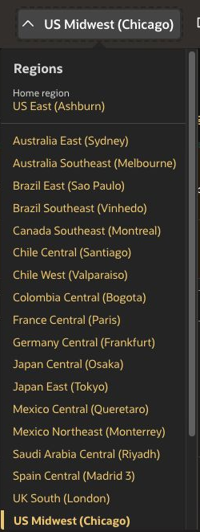

*O seletor fica no cabeçalho da Console. **US Midwest (Chicago)** é a região
deste roteiro; a indicação **Home region** pode aparecer em outra região.*

A **home region pode ser diferente**. IAM é global e o Terraform usa o endpoint
da home region para criá-lo; VM, rede e inferência ficam na região da instalação.
Se o Trial só permite **São Paulo (`sa-saopaulo-1`)**, selecione explicitamente
**Llama 3.3 70B** no formulário. Este pacote não oferece GPT-OSS/Grok on-demand
em GRU nem cria cluster dedicado como alternativa automática.

Grok é uma opção explícita no formulário em ORD, mas seus modelos são hospedados
externamente pela xAI: escolher a região OCI não significa processamento
exclusivamente dentro dela. Veja as [notas de chamadas externas da OCI](https://docs.oracle.com/en-us/iaas/Content/generative-ai/model-endpoint-regions.htm#xai-models).

**Antes de continuar:** você consegue entrar na Console e vê a região desejada
no cabeçalho. A próxima etapa acontece no Telegram, sem fechar este guia.

## 2. Crie seu bot no Telegram

1. Abra o [@BotFather oficial](https://t.me/BotFather) e toque **Start / Iniciar**.
2. Envie **`/newbot`**.
3. Quando o BotFather perguntar **“How are we going to call it?”**, informe o
   **nome de exibição**, por exemplo **Meu Hermes OCI**. Na captura fornecida,
   o nome escolhido foi `teste_bot_hermes`. Esse ainda não é o username.
4. Na pergunta **“Let's choose a username for your bot”**, envie um
   **username único terminado em `bot`**, por exemplo `meu_hermes_evento_bot`.
   Na captura, a primeira tentativa sem esse final foi recusada; acrescentar
   `_bot` permitiu continuar. Se o nome já estiver ocupado, escolha outra
   combinação que continue terminando em `bot`.

   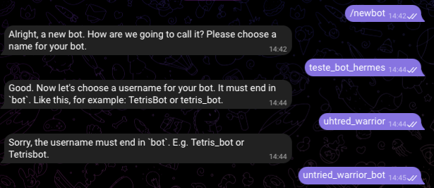

   *Recorte real: o BotFather pede primeiro o nome e depois o username. A mensagem
   **Sorry, the username must end in bot** indica que basta corrigir o username
   e enviá-lo no mesmo chat; não é preciso começar outro `/newbot`.*

5. A mensagem **“Done! Congratulations on your new bot”** confirma a criação.
   Nessa mesma mensagem, guarde **duas informações diferentes**:

   | Informação recebida | Onde aparece | Como será usada |
   |---|---|---|
   | Link do seu bot | Depois de **You will find it at**, no formato `t.me/SEU_USERNAME_BOT` | Abrir a conversa com o seu Hermes na etapa 7 |
   | Token privado | Abaixo de **Use this token to access the HTTP API** | Preencher **Token do BotFather** e sua confirmação na Stack, etapa 4 |

   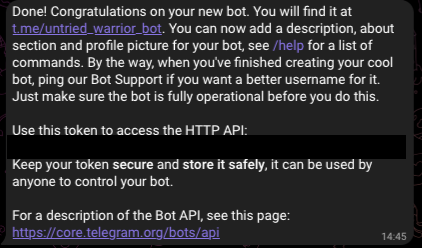

   *Recorte real: o link aparece no início da confirmação e o token fica abaixo
   da indicação **HTTP API**. A tarja foi acrescentada para ocultar a credencial;
   ela não faz parte do Telegram. Use o link e o token da **sua** conversa, não
   o bot mostrado no exemplo.*

O token é uma credencial, não o nome nem o link do bot. No formulário OCI,
ele corresponde à variável `telegram_bot_token`.

Não envie o token ao facilitador, ao próprio bot ou ao GitHub. Use um bot exclusivo.
**Não precisa descobrir chat ID nem criar API key OCI:** o vínculo identifica
seu usuário, e a VM acessa o modelo com Instance Principals.

**Antes de continuar:** guarde tanto o token quanto o link do **seu** bot.
O BotFather cria o bot; a conversa com o Hermes acontecerá no outro chat,
depois do pareamento na [etapa 7](#7-vincule-sua-conta-ao-bot).

**Se um token aparecer em um print compartilhado ou no GitHub**, recomendamos
substituí-lo pelo BotFather antes de usar o bot. Ocultar uma cópia da imagem
não invalida o token original. A [documentação do Telegram](https://core.telegram.org/bots/features#generating-an-authentication-token)
orienta gerar um novo token quando houver exposição. Se já houver uma instalação,
revise o impacto de atualizar a configuração antes de aplicar mudanças na Stack.

## 3. Abra Create Stack na Console OCI

### Antes de abrir a Console

Confira se você já tem:

- A conta OCI conectada, a região da instalação selecionada e créditos/permissões disponíveis.
- Um **bot exclusivo**, seu token e o link de conversa guardados em local privado.
- Este guia aberto, para voltar a ele a cada etapa.

### Pelo botão de implantação

**Abra o botão abaixo em uma nova aba:** botão direito → **Abrir link em nova
aba**, ou `Ctrl` + clique no Windows/Linux e `⌘` + clique no macOS. Assim esta
página continua no ponto em que você parou.

[](https://cloud.oracle.com/resourcemanager/stacks/create?zipUrl=https%3A%2F%2Fgithub.com%2Frafaelrdias%2Foci-hermes-workshop%2Farchive%2Frefs%2Fheads%2Fresource-manager.zip)

**O que acontece ao clicar?** A Console OCI abre o assistente **Create stack**
com o pacote Terraform deste repositório pré-selecionado. O pacote vem da branch
`resource-manager`, que contém somente os arquivos necessários à implantação.
Você **não precisa baixar nem enviar uma pasta por este caminho**.

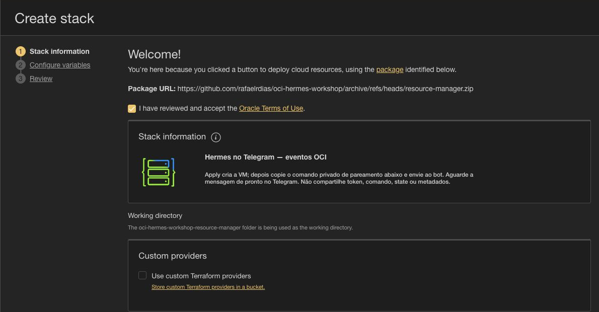

*Na tela **Welcome!**, confira **Package URL** terminando em
`oci-hermes-workshop/archive/refs/heads/resource-manager.zip`, o título
**Hermes no Telegram — eventos OCI** e o diretório
`oci-hermes-workshop-resource-manager`. Leia os **Oracle Terms of Use** e
prossiga somente se concordar. Não é a tela de upload por Folder.*

O botão não cria uma conta OCI, não copia o token do Telegram e não instala
o Hermes imediatamente. Você ainda conferirá as variáveis e autorizará a
execução. Se a Console pedir login, entre na **sua tenancy**, confira a região
e verifique se voltou a **Create stack** com o pacote selecionado. Se cair na
página inicial, volte a esta etapa e abra o botão novamente — antes de criar
qualquer Stack.

> **Ponto de retorno:** ao abrir o formulário, mantenha a aba da Console aberta
> e continue lendo aqui. Primeiro confira os dados abaixo; depois siga para
> [4. Variáveis e aceites](#4-preencha-as-variáveis-e-os-aceites).

<details>
<summary>Alternativa: enviar a pasta pela Console, sem comandos</summary>

Use esta alternativa apenas se preferir upload manual ou se o pacote não
carregar pelo botão. **Escolha um caminho; não crie duas Stacks.**

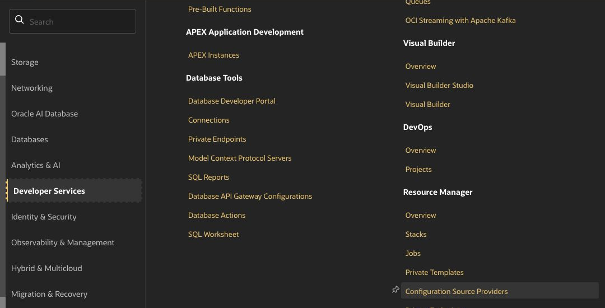

*No menu principal, **Developer Services → Resource Manager → Stacks**.
Talvez seja necessário rolar o menu. Não confunda com o item **Stacks** de
outro serviço. Na lista, escolha **Create Stack**.*

1. [Baixe a pasta Terraform](https://github.com/rafaelrdias/oci-hermes-workshop/archive/refs/heads/resource-manager.zip).
   O GitHub a transporta em ZIP: **extraia uma vez**.
2. Abra **Developer Services → Resource Manager → Stacks → Create Stack**.
   Também pode pesquisar **Resource Manager** na busca da Console.
3. Em **My configuration → Folder**, selecione a pasta extraída
   **`oci-hermes-workshop-resource-manager`**, onde estão `main.tf` e `schema.yaml`.
4. Não selecione o repositório inteiro nem uma pasta com `.terraform`.
   O pacote leve não inclui imagens ou binários de providers.

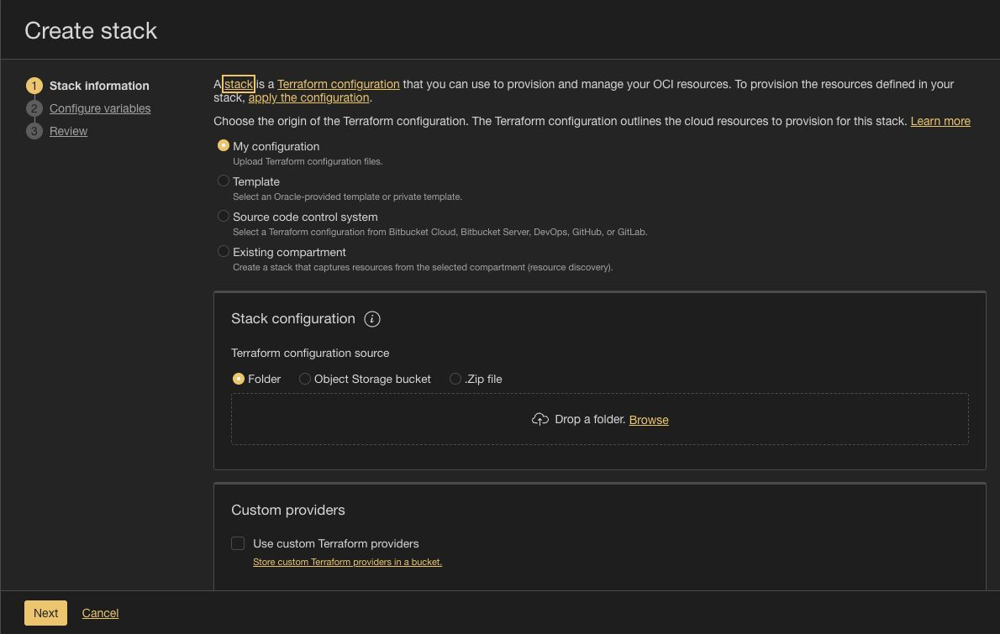

*Captura real: a opção **Folder** fica em **Stack configuration**. O link
**Browse** recebe a pasta extraída, não o repositório completo.*

</details>

### Confira os dados da Stack

Role a etapa **Stack information** para encontrar os campos abaixo:

1. **Name:** sugerimos `hermes-evento`. Pelo botão, a Console propõe um nome
   derivado do arquivo e da data; você pode substituí-lo por esse nome mais fácil
   de localizar depois. **Description** pode ficar com a descrição do pacote.

   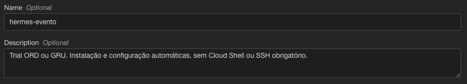

2. **Create in compartment:** escolha **o compartimento raiz da sua tenancy**,
   identificado pelo sufixo **`(root)`**. O nome será o da sua conta, não
   necessariamente igual ao de outro participante. Esse é o local da **Stack**;
   o Terraform criará um compartment separado para a VM.
3. **Terraform version:** na captura, a opção oferecida é **1.5.x**, compatível
   com este pacote (>= 1.5 e < 2.0). Deixe **Use custom Terraform providers**
   desmarcado. Não é necessário preencher **Tags** para este laboratório.

   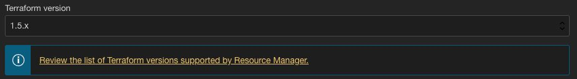

4. Clique **Next**. `tenancy_ocid` é preenchido automaticamente pela Console;
   não é necessário copiar OCIDs manualmente neste fluxo.

**Ponto de conferência:** a lateral agora destaca **Configure variables**.
Continue na etapa 4 deste guia; o número da etapa da Console é diferente do
número das etapas aqui.

## 4. Preencha as variáveis e os aceites

Em **Configure variables**, os campos são organizados em quatro grupos.
Este guia corresponde ao pacote **1.5.0**; essa versão é a do laboratório,
não a versão **1.5.x** do Terraform.

### Região e modelo

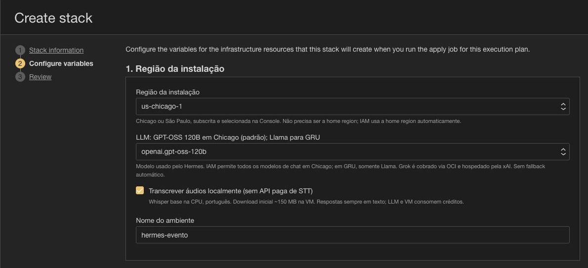

*Confira a região **no cabeçalho e no formulário**. Em Chicago, o modelo padrão
é `openai.gpt-oss-120b`. **Nome do ambiente** nomeia os recursos criados; é um
campo diferente do **Name** da Stack, embora ambos possam ser `hermes-evento`.*

| Campo | Como preencher |
|---|---|
| Região da instalação | `us-chicago-1` |
| LLM | `openai.gpt-oss-120b` |
| Transcrever áudios localmente | Marcado |
| Nome do ambiente | `hermes-evento`, ou outro nome exclusivo |
| Token do BotFather | Seu token no campo mascarado e na confirmação |
| Aceite de persistência do token | Leia e marque se concordar; obrigatório |
| Shape | E5.Flex padrão: 1 OCPU / 8 GB / 50 GB; consome créditos |
| Availability domain | `0` para o primeiro AD; outro índice somente se disponível |

### Token e consentimento

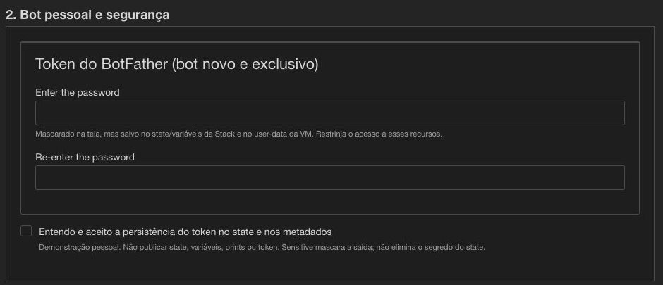

*Dentro de **Token do BotFather (bot novo e exclusivo)**, cole o mesmo token
em **Enter the password** e **Re-enter the password**. A captura mostra ambos
vazios de propósito. Leia o aviso e marque **Entendo e aceito a persistência do
token no state e nos metadados** se concordar.*

**São três aceites distintos:** token no state/metadados (sempre), chave privada
SSH no state (se gerar SSH) e SSH público (somente com `0.0.0.0/0`).
Marcar o aceite SSH não marca o do token. Sem aceite obrigatório, o Plan é
bloqueado: corrija em **Edit Stack → Configure variables**.

### Compute

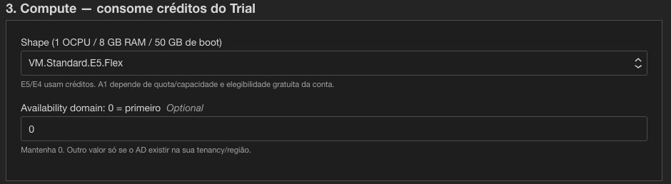

*O grupo **3. Compute — consome créditos do Trial** define a VM. A escolha
do shape não garante capacidade disponível na região. Para o primeiro teste,
recomendamos manter o padrão e conferir eventuais erros no job.*

**Antes de avançar:** os dois campos de token devem coincidir e o aceite do
token precisa estar marcado. Abaixo de Compute fica o grupo opcional de SSH.

## 5. Escolha se quer SSH — opcional

Para usar só Telegram, deixe geração desmarcada e chave pública/CIDR vazios.

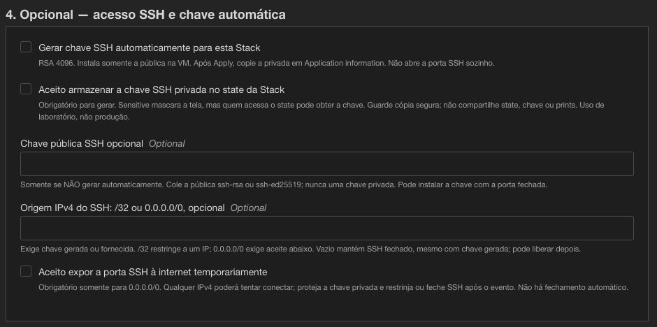

*Esse é o caminho sem SSH: geração desmarcada, chave pública e origem IPv4
vazias. O Telegram não depende de abrir a porta 22.*

<details>
<summary>Quero gerar uma chave para administrar a VM depois</summary>

Para administrar a VM posteriormente:

1. Marque **Gerar chave SSH automaticamente para esta Stack**.
2. Marque o aceite **da chave privada no state** e deixe a pública manual vazia.
3. Deixe **Origem IPv4 do SSH** vazia para manter a porta fechada; a pública já
   será instalada. Para conectar agora, informe seu IPv4 público com `/32`.
4. Para qualquer IPv4 no evento, informe `0.0.0.0/0` e aceite a exposição.
   Qualquer IPv4 poderá tentar conectar; a liberação não expira automaticamente.

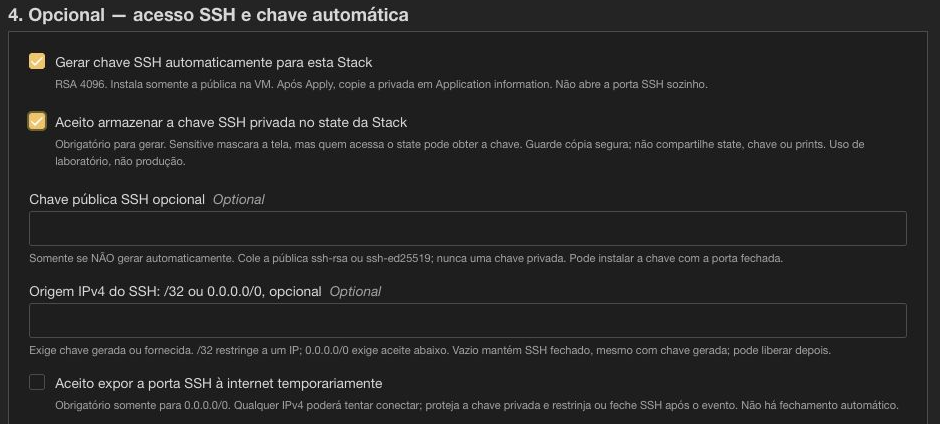

*Na captura, a geração e seu aceite estão marcados, mas o CIDR continua vazio:
a chave será instalada e **a porta permanecerá fechada**. Abrir o acesso agora
exige também configurar a origem IPv4.*

Você também pode **não gerar** e fornecer sua chave pública `.pub`. Não escolha
os dois caminhos. A privada nunca deve ser colada como variável.
[Como recuperar a chave e acessar a VM](docs/SSH.md).

</details>

Ao terminar as variáveis, clique **Next** na Console. Você chegará a **Review**;
continue a leitura abaixo antes de clicar em **Create**.

## 6. Execute Plan e Apply

### Criar a Stack sem executar automaticamente

Em **Review**, confira nome, região e aceite do token. A Console informa que
essa revisão mostra apenas variáveis sem padrão ou que você alterou; por isso,
nem todos os campos aparecerão. Use **Previous** para conferir algo que faltar.

**Desmarque Run apply**, que vem marcado por padrão ao abrir pelo botão.
Recomendamos separar a revisão do plano da execução neste laboratório.

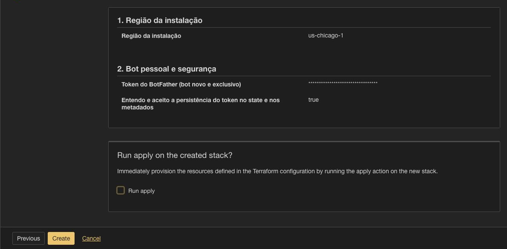

*Somente depois dessa conferência, clique **Create**. Com **Run apply**
desmarcado, você cria o registro da Stack, não a VM. O token está mascarado
pela própria Console; não é necessário revelá-lo para revisar.*

### Gerar e revisar o plano

1. Na página da **Stack recém-criada**, clique **Plan**.
2. No painel **Plan**, você pode manter o nome sugerido para o job e as opções
   avançadas no padrão. Confirme em **Plan**.
3. Abra o job em **Jobs**, acompanhe **Logs** e aguarde **Succeeded**.
4. Revise o que será criado: VM, disco, rede, compartment, DG/policy e, se
   escolhido, par SSH. Não deve haver GPU ou cluster dedicado. **Plan não cria
   a VM e não valida uma conversa com o modelo.**

### Aplicar o plano revisado

1. Volte à **mesma Stack**, pelo nome/breadcrumb; não volte ao botão Deploy.
2. Clique **Apply**. Em **Apply job plan resolution**, selecione o último job
   **Plan** que você revisou. Se aparecer apenas **Automatically approve**,
   confira se está na Stack correta e se gerou o Plan nela.
3. Confirme em **Apply**. Acompanhe o novo job até **Succeeded**. Se falhar,
   abra **Logs**, identifique o erro e consulte o [diagnóstico](docs/OPERACAO.md)
   antes de criar outra Stack ou repetir a execução.

Referências da Oracle para os painéis: [Plan](https://docs.oracle.com/en-us/iaas/Content/ResourceManager/Tasks/create-job-plan.htm)
e [Apply](https://docs.oracle.com/en-us/iaas/Content/ResourceManager/Tasks/create-job-apply.htm).

**Apply concluído não significa Hermes pronto.** Ainda pode haver instalação
de dependências, download da transcrição, propagação IAM e testes do agente.
Cadastro, downloads, capacidade e quotas variam: não há prazo fixo garantido.
Não dispare instalações duplicadas para tentar acelerar.

| Confirmação | O que ela significa | Próximo passo |
|---|---|---|
| Job Plan: **Succeeded** | O plano foi gerado | Revisar e executar Apply |
| Job Apply: **Succeeded** | O Terraform concluiu o provisionamento | Buscar o comando na própria Stack |
| Telegram: **Conta vinculada!** | Seu usuário foi vinculado | Aguardar validações do instalador |
| Telegram: **Configuração concluída!** | Os testes iniciais terminaram | Enviar `/new` e fazer o teste final |

**Ponto de retorno:** com Apply concluído, continue na etapa 7. A página da VM
não é o lugar de recuperar o comando do Telegram.

## 7. Vincule sua conta ao bot

1. Abra **Resource Manager → Stacks → a Stack que acabou de executar**.
2. Na página **da Stack**, abra **Application information** — não procure
   essa informação na VM, no BotFather ou apenas nos logs do job.
3. Em **Próximo passo no Telegram**, localize **Desbloqueie, copie e envie este
   comando em DM ao seu bot**. Esse é o título da saída **`telegram_pairing_command`**.
   Desbloqueie/revele e copie seu valor completo.

O caminho é **Resource Manager → Stacks → nome da sua Stack → Application
information → Próximo passo no Telegram**. Se estiver na página de um job,
volte primeiro ao nome da **Stack**. Se a lista estiver vazia, confira a região
e o filtro de compartment — este guia cria a Stack no compartimento **`(root)`**.

| Título definido no formulário | Nome técnico da saída | Para que serve |
|---|---|---|
| Desbloqueie, copie e envie este comando em DM ao seu bot | `telegram_pairing_command` | Comando privado completo a enviar ao seu bot |
| Como concluir | `next_step` | Orientação para continuar após o Apply |
| Modelo OCI on-demand | `model` | Identificador real do modelo OCI selecionado |
| IPv4 da VM (sem serviço web público) | `public_ip` | Endereço da VM, apenas para administração opcional |

A saída de pareamento é sensível: use o controle de revelar/copiar da Console
sem projetar o valor na tela. Não copie tokens ou comandos de imagens de exemplo.

4. Abra **seu bot**, pelo link recebido do BotFather. Toque **Start / Iniciar**
   se necessário e envie **o comando completo copiado**, incluindo o código.
   `/start` sozinho não realiza o vínculo deste laboratório.
5. Aguarde **“Conta vinculada!”** e depois **“Configuração concluída!”**.
   Se enviou antes de o instalador estar ouvindo e não houve confirmação,
   aguarde o bootstrap e reenvie o comando, sem repetir continuamente.

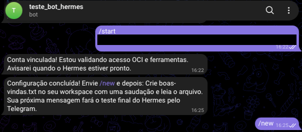

*Recorte real no chat do **bot criado**, não no BotFather. O texto privado após
`/start` está coberto por uma tarja. Os horários registram essa execução e não
representam um prazo garantido para todas as instalações.*

Veja como ler a sequência da imagem:

- **`/start` com o código da Stack:** solicita o vínculo. Copie a saída completa
  da OCI; o código de pareamento **não é o token do BotFather**. A quebra de
  linha da bolha é apenas a forma como o Telegram apresenta a mensagem.
- **Conta vinculada!**: o instalador identificou sua conta e ainda está
  validando o acesso OCI e as ferramentas. Essa mensagem não significa que
  já terminou.
- **Configuração concluída!**: os testes iniciais terminaram e o bot orienta
  o próximo passo. Agora você pode enviar **`/new`** para iniciar a sessão.
- Depois da confirmação da nova sessão, faça o teste de arquivo da etapa 8.

Se só aparecer a primeira confirmação, aguarde a próxima mensagem; não é
necessário criar outro bot nem repetir o Apply para refazer o vínculo.

O primeiro usuário que enviar o código válido em DM será o dono autorizado.
Não projete nem compartilhe esse código. Não precisa chat ID ou aprovação SSH.
Em nova Stack, use a nova saída.

## 8. Converse e teste ferramentas e áudio

Depois de **Configuração concluída**, envie **`/new`**, aguarde a confirmação e peça:

```text
Crie boas-vindas.txt no seu workspace com uma saudação e leia o arquivo mostrando o resultado.
```

O agente deve criar, ler e mostrar o conteúdo, não apenas prometer executar.

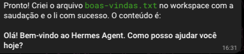

*Resposta exibida na captura fornecida: o Hermes informa a criação e leitura de
`boas-vindas.txt` e apresenta a saudação. O texto da resposta pode variar; o
objetivo é conferir a execução da tarefa e a exibição do conteúdo.*

Depois envie um áudio curto em português pedindo três ideias para aplicar IA
no seu trabalho. A transcrição acontece na VM; a resposta vem **por texto**.
Esse teste de áudio é adicional: ele não aparece na captura acima.

O nome exibido na sessão pode ser **`hermes-oci`**, alias local do modelo.
O modelo OCI selecionado aparece na saída **`model`** da Stack. Não use dados
confidenciais nos exercícios. Veja [diagnóstico](docs/OPERACAO.md) se houver demora ou erro.

## 9. Ao terminar: guardar ou remover

Se continuar usando o agente, acompanhe custo/crédito e restrinja SSH.
Para remover os recursos:

1. Salve os arquivos/memórias desejados e sua chave privada, se necessária.
2. Abra **a própria Stack → Terraform actions → Destroy** (ou ação Destroy).
3. Revise e confirme. **VM, disco, arquivos, histórico, rede e IAM gerenciados
   pela Stack serão removidos.** Aguarde o job **Succeeded**.
4. Só então exclua a Stack, se desejar. Excluir sem Destroy não garante remover
   os recursos. O bot é separado: gerencie/revogue seu token no BotFather.

Históricos de jobs/state e cópias locais podem reter segredos. Destroy não apaga
arquivos baixados nem revoga o token Telegram.

## Para continuar

- [SSH e ajustes do Hermes](docs/SSH.md)
- [Problemas, limites e operação](docs/OPERACAO.md)
- [Arquitetura e segurança](docs/ARQUITETURA.md)
- [Validação e manutenção](docs/MANUTENCAO.md)
- [Origem e cobertura das capturas da Console](docs/TELAS.md)

O [Hermes Agent](https://github.com/NousResearch/hermes-agent) combina LLM e
ferramentas: o modelo decide ações e o agente as executa. Este ambiente é uma
demonstração pessoal, não um sandbox multiusuário. Terminal/rede podem executar
ações reais; não habilite acesso irrestrito nem use documentos sigilosos.

## Referências

- [OCI Resource Manager](https://docs.oracle.com/en-us/iaas/Content/ResourceManager/home.htm)
- [Como funciona o botão Deploy to Oracle Cloud](https://docs.oracle.com/en-us/iaas/Content/ResourceManager/Tasks/deploybutton.htm)
- [Modelos Generative AI por região](https://docs.oracle.com/en-us/iaas/Content/generative-ai/model-endpoint-regions.htm)
- [BotFather — documentação Telegram](https://core.telegram.org/bots/features#botfather)
- [Agent Station Experience — referência de organização do guia](https://github.com/MachadoAmanda/oracle/tree/main/Agent%20Station%20Experience)
