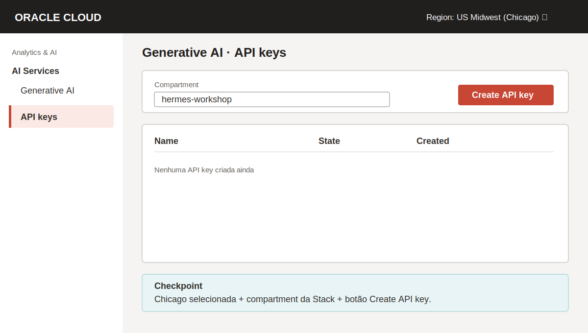
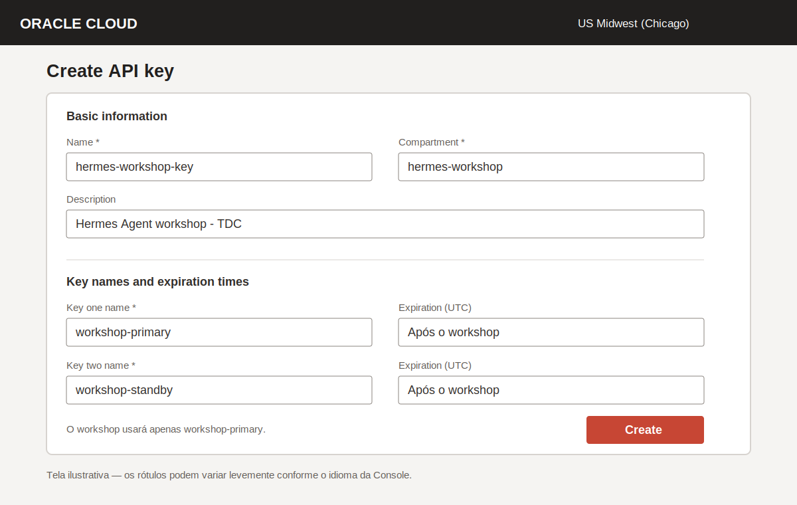
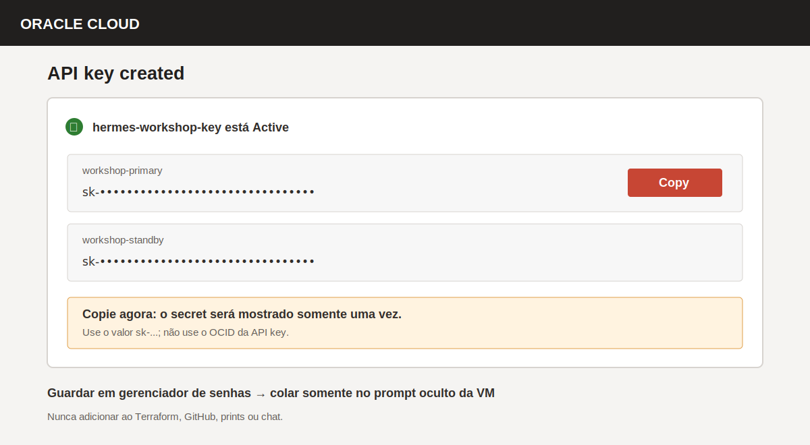
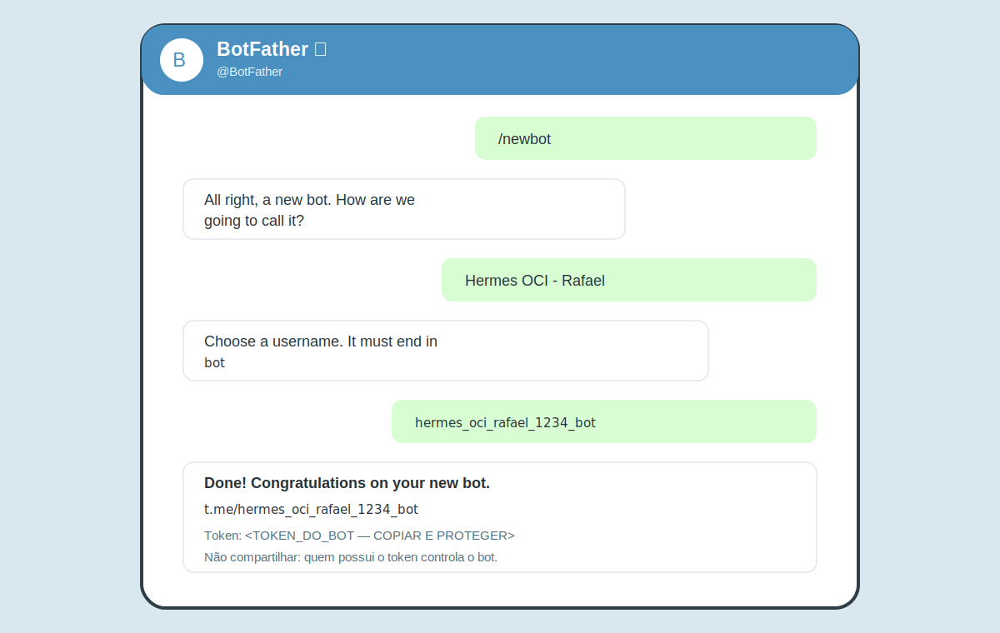
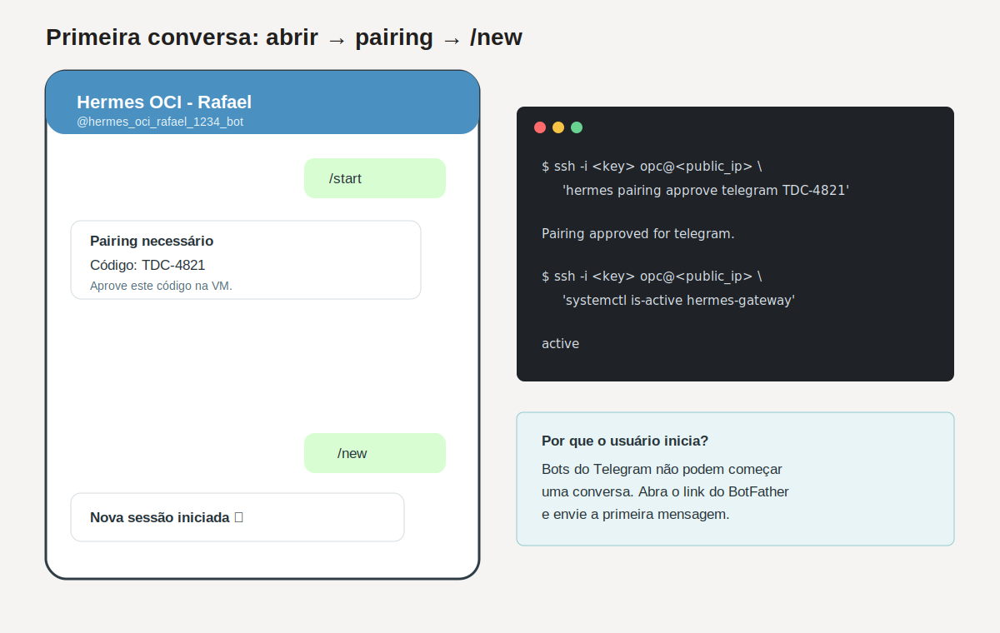

# Credenciais do workshop — OCI Generative AI e Telegram

Este guia mostra como obter as duas credenciais que não passam pelo Terraform:

1. o segredo da **OCI Generative AI API key**, usado pelo Hermes no endpoint OpenAI-compatible;
2. o **token do bot do Telegram**, criado pelo `@BotFather`.

Ao final, você também abrirá o bot, fará o pairing seguro e iniciará a primeira conversa.

> Faça estes passos somente na sua própria tenancy e na sua conta do Telegram. Não coloque o segredo `sk-...` ou o token do bot no Terraform, GitHub, chat do evento, prints ou comandos de terminal.

## O que você precisa guardar

| Item | Onde é obtido | Obrigatório? | Onde será usado |
|---|---|---:|---|
| OCI Generative AI API key secret | OCI Console | Sim | prompt oculto do `hermes-workshop-configure` |
| Token do bot | `@BotFather` | Sim | prompt oculto do `hermes-workshop-configure` |
| Username do bot | `@BotFather` | Sim | localizar o bot no Telegram |
| Link `https://t.me/<username>` | `@BotFather` | Recomendado | abrir a conversa diretamente |
| Telegram user ID numérico | Não é fornecido pelo BotFather | Não | pode ser substituído pelo pairing seguro |

## Parte 1 — criar a API key OpenAI-compatible na OCI

### 1. Confirmar região e compartment

1. entre na [OCI Console](https://cloud.oracle.com/);
2. no seletor de região da barra superior, escolha **US Midwest (Chicago)**;
3. confirme que o código da região é `us-chicago-1`;
4. abra o menu de navegação;
5. selecione **Analytics & AI → AI Services → Generative AI**;
6. no menu do Generative AI, selecione **API keys**;
7. no filtro **Compartment**, escolha o mesmo compartment usado pela Stack do workshop.



> Esta é uma **OCI Generative AI API key**. Ela não é a API key IAM encontrada no perfil do usuário e não usa arquivos `.pem`.

### 2. Criar a chave

1. clique em **Create API key**;
2. em **Name**, informe `hermes-workshop-key`;
3. em **Description**, informe `Hermes Agent workshop - TDC`;
4. confirme o compartment do laboratório;
5. em **Key one name**, informe `workshop-primary`;
6. em **Key two name**, informe `workshop-standby`;
7. mantenha a expiração padrão ou defina uma data curta posterior ao workshop;
8. clique em **Create**.

Os dois secrets pertencem à mesma API key e têm a mesma permissão. Para o workshop, use somente o secret `workshop-primary`; o segundo permite rotação sem interrupção.



### 3. Copiar o secret

1. na confirmação da criação, localize `workshop-primary`;
2. clique em **Copy** ao lado do secret iniciado por `sk-`;
3. guarde temporariamente em um gerenciador de senhas;
4. não copie o OCID da API key no lugar do secret;
5. confirme que a API key aparece com estado **Active**.



O secret novo ou regenerado é exibido somente uma vez. Se fechar a janela sem copiá-lo, gere um novo secret pela página de detalhes da API key.

### 4. Confirmar a permissão IAM

O Terraform do workshop cria esta policy de menor privilégio:

```text
allow any-user to use generative-ai-chat
in compartment id <COMPARTMENT_OCID>
where ALL {
  request.principal.type='generativeaiapikey',
  target.model.id='openai.gpt-oss-120b'
}
```

Ela autoriza somente principals autenticados do tipo `generativeaiapikey`, no modelo utilizado pelo workshop. Se a Stack foi criada com `create_genai_policy = false`, um administrador da tenancy precisa criar uma policy equivalente antes do teste.

Checklist:

- API key criada em **US Midwest (Chicago)**;
- API key no mesmo compartment autorizado pela policy;
- secret iniciado por `sk-`, e não um OCID;
- modelo `openai.gpt-oss-120b`;
- endpoint configurado pelo workshop:
  `https://inference.generativeai.us-chicago-1.oci.oraclecloud.com/20231130/actions/v1`.

## Parte 2 — criar o bot com o @BotFather

### 5. Abrir o BotFather correto

1. abra o Telegram;
2. acesse diretamente [https://t.me/BotFather](https://t.me/BotFather) ou pesquise por `@BotFather`;
3. confirme que o username é exatamente `@BotFather`;
4. toque em **Start** ou envie `/start`.

Evite bots com nomes parecidos. O token entregue pelo BotFather dá controle total sobre o seu bot.

### 6. Criar o bot

Na conversa com o `@BotFather`:

1. envie `/newbot`;
2. quando ele pedir o nome, informe um nome visível, por exemplo:
   `Hermes OCI - Rafael`;
3. quando ele pedir o username, informe um valor globalmente único:
   `hermes_oci_rafael_1234_bot`;
4. o username deve ter entre 5 e 32 caracteres, usar letras latinas, números ou `_` e terminar em `bot`;
5. aguarde a mensagem de confirmação.

Durante o workshop, acrescente suas iniciais e quatro números ao username para reduzir conflitos.



### 7. Guardar as informações corretas

Da mensagem final do BotFather, guarde:

- **token do bot**: será inserido no prompt oculto da VM;
- **username**: por exemplo, `@hermes_oci_rafael_1234_bot`;
- **link do bot**: por exemplo, `https://t.me/hermes_oci_rafael_1234_bot`.

O BotFather não fornece o seu Telegram user ID numérico. No caminho recomendado do workshop, deixe esse campo vazio no configurador e use o pairing seguro.

Se um token real aparecer em print, chat ou repositório, abra o `@BotFather`, envie `/token`, escolha o bot e gere um token novo antes de continuar.

## Parte 3 — configurar e conversar com o bot

### 8. Inserir os secrets na VM

Depois que `cloud-init status --wait` terminar com `status: done`, execute no seu computador:

```bash
ssh -t -i <caminho-da-chave-privada> opc@<public_ip> 'hermes-workshop-configure'
```

O assistente pedirá:

1. `OCI Generative AI API key`: cole o secret `sk-...`;
2. `Telegram bot token from @BotFather`: cole o token;
3. `Telegram numeric user ID`: pressione **Enter** para usar pairing.

A entrada dos dois secrets fica oculta. Não tente digitá-los como parte do comando SSH.

### 9. Abrir a conversa

1. abra o link `https://t.me/<username>` entregue pelo BotFather; ou
2. pesquise pelo username exato, incluindo `@`;
3. confira o nome e o username do bot;
4. toque em **Start** ou envie `/start`.

Bots do Telegram não podem iniciar uma conversa com usuários. A primeira mensagem precisa partir de você.

### 10. Aprovar o pairing

Quando o Hermes estiver configurado sem user ID:

1. envie `/start` ou qualquer mensagem privada ao bot;
2. copie o código de pairing retornado;
3. aprove o código pela VM:

```bash
ssh -i <caminho-da-chave-privada> opc@<public_ip> 'hermes pairing approve telegram CODIGO'
```

4. volte ao Telegram;
5. envie `/new` para iniciar uma nova sessão;
6. envie o primeiro prompt:

```text
Explique em três bullets quais componentes OCI sustentam você.
```



## Validação rápida

O fluxo está correto quando:

- o configurador imprime `OCI Generative AI configured successfully`;
- `hermes-gateway` fica com estado `active (running)`;
- o pairing é aprovado;
- `/new` inicia uma sessão;
- o bot responde ao prompt usando `openai.gpt-oss-120b`.

Na VM:

```bash
sudo systemctl status hermes-gateway --no-pager
sudo journalctl -u hermes-gateway -n 100 --no-pager
hermes doctor
```

## Problemas comuns

| Sintoma | Correção |
|---|---|
| A API key retorna `401` | Confirme que foi usado o secret `sk-...`, que a key está Active e que ela foi criada em Chicago. |
| A API key retorna `403` | Confirme o compartment e a policy para `generativeaiapikey` e `openai.gpt-oss-120b`. |
| O username do bot é recusado | Use somente letras latinas, números e `_`, termine em `bot` e escolha um valor ainda não utilizado. |
| O bot abre, mas não responde | Termine `hermes-workshop-configure` e verifique o serviço `hermes-gateway`. |
| O bot devolve um código | É o comportamento esperado do pairing; aprove o código pela VM. |
| O pairing foi aprovado, mas a mensagem antiga não recebeu resposta | Envie `/new` ou uma nova mensagem; a mensagem que gerou o código não é repetida. |
| O token foi exposto | Gere um novo token com `/token` no `@BotFather` e execute novamente `hermes-workshop-configure --telegram-only`. |

## Referências oficiais

- [OCI — listar API keys no Generative AI](https://docs.oracle.com/en-us/iaas/Content/generative-ai/list-api-keys.htm)
- [OCI — criar uma Generative AI API key](https://docs.oracle.com/en-us/iaas/Content/generative-ai/create-api-key.htm)
- [OCI — usar API keys com SDK OpenAI](https://docs.oracle.com/en-us/iaas/Content/generative-ai/api-keys.htm)
- [OCI — adicionar permissões para API keys](https://docs.oracle.com/en-us/iaas/Content/generative-ai/add-api-permission.htm)
- [Telegram — criar um bot com o BotFather](https://core.telegram.org/bots/features#creating-a-new-bot)
- [Telegram — como usuários iniciam uma conversa com bots](https://core.telegram.org/bots#how-do-bots-work)
