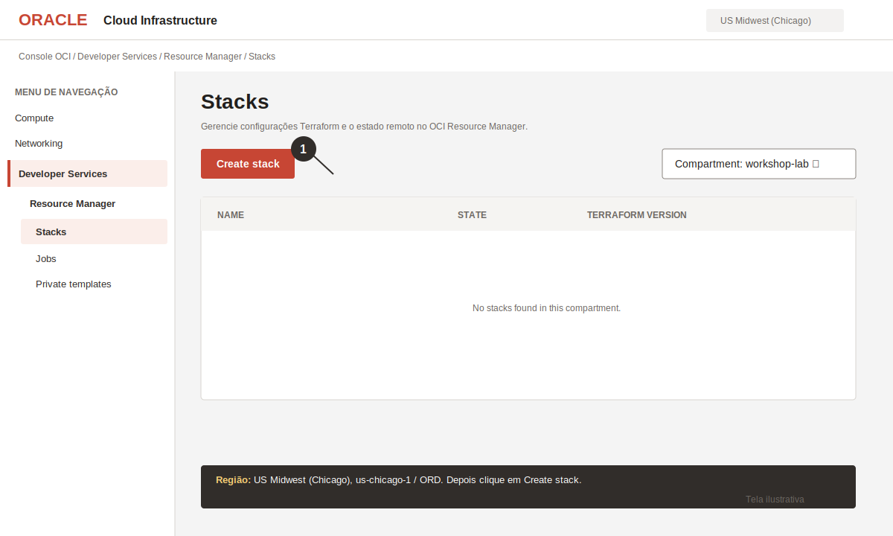
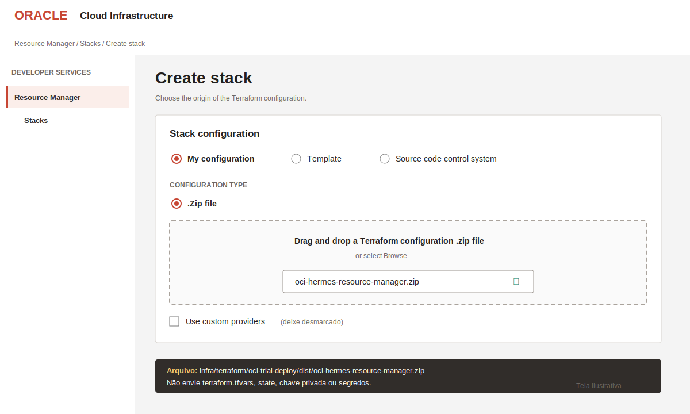
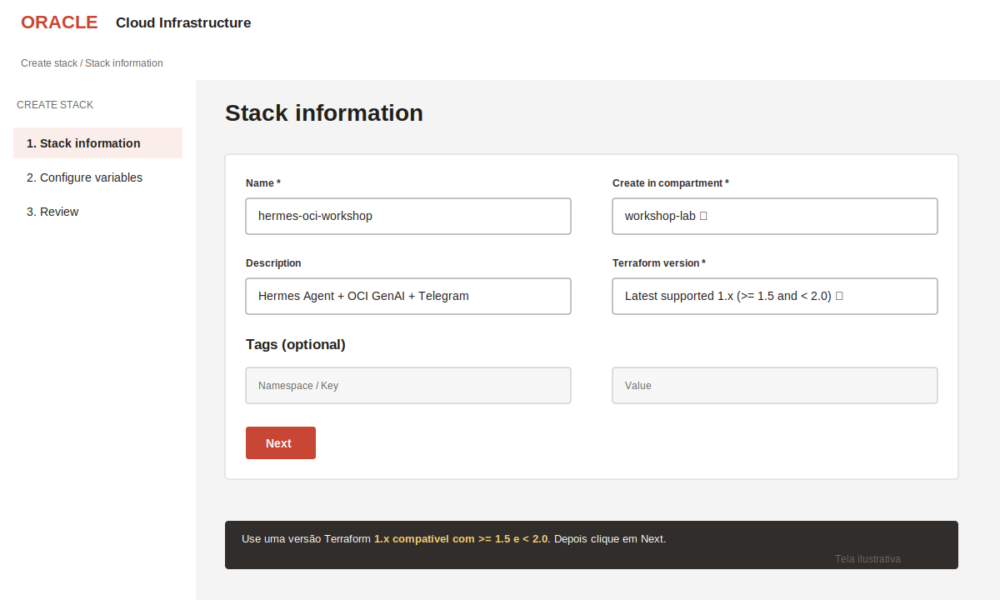
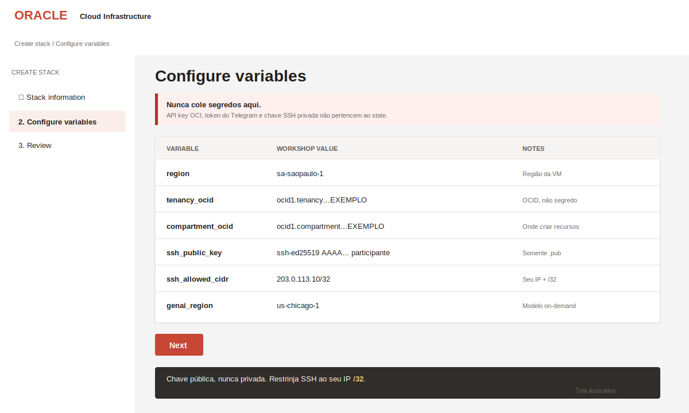
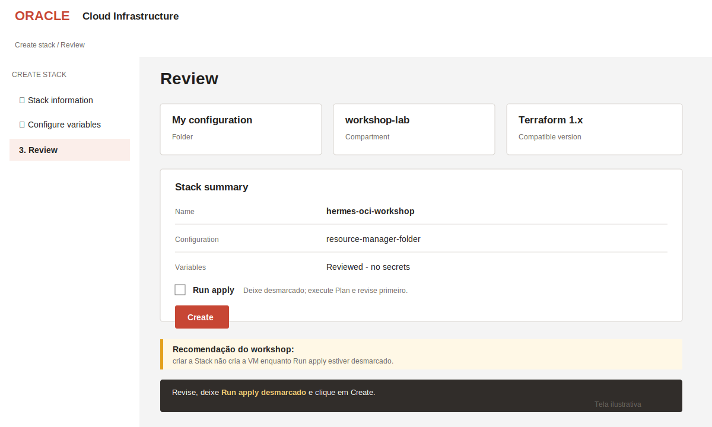
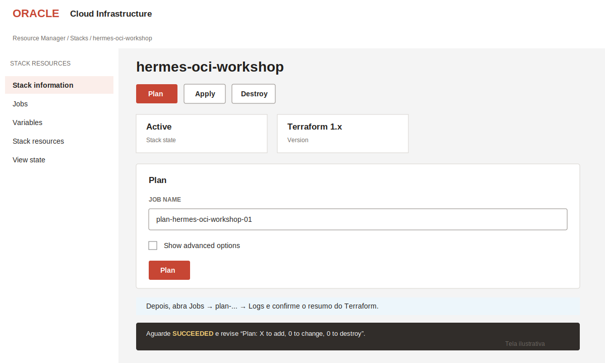
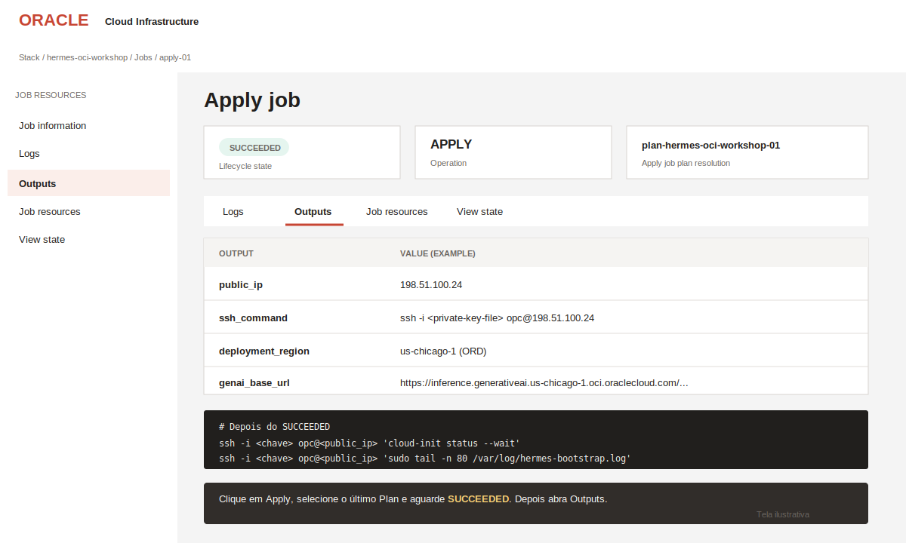
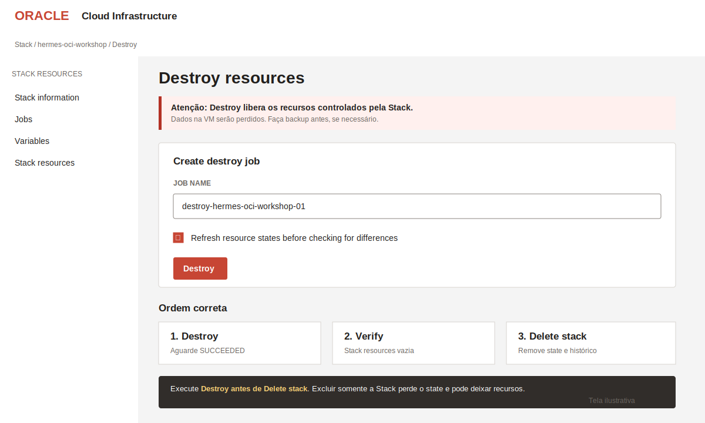

# Provisionar pela Console OCI — Resource Manager

Este é o caminho recomendado para o workshop. O **OCI Resource Manager** executa o Terraform dentro da OCI, mantém o state da Stack e dispensa a instalação local do Terraform e da OCI CLI.

Todo o fluxo deve ser executado em **US Midwest (Chicago)**: identificador `us-chicago-1`, region key `ORD`. A Stack e seus jobs são regionais; por isso, selecione Chicago antes de abrir o Resource Manager.

> As telas abaixo são ilustrações fiéis ao fluxo atual da Console OCI. O idioma, a posição de alguns controles e a versão mais nova disponível do Terraform podem variar ligeiramente na tenancy.

## Resultado

Ao concluir este roteiro, a Stack terá criado:

- VCN, subnet pública, Internet Gateway, route table e security list;
- VM Oracle Linux em Chicago com acesso SSH restrito ao IP do participante;
- Hermes Agent e gateway do Telegram instalados pelo cloud-init;
- configuração do Hermes apontando para o endpoint do OCI Generative AI em Chicago;
- policy de menor privilégio para o OCI Generative AI, quando autorizada.

A API key do OCI Generative AI é criada manualmente em Chicago. Seu segredo e o token do BotFather **não** passam pelo Terraform; eles são inseridos depois, diretamente na VM.

## Antes de abrir a Stack

Tenha em mãos:

1. acesso à Console OCI, inscrição em **US Midwest (Chicago)** e um compartment para o laboratório;
2. `tenancy_ocid` e `compartment_ocid`;
3. o conteúdo completo da chave SSH **pública** (`.pub`);
4. seu IP público no formato CIDR, por exemplo `203.0.113.10/32`;
5. permissão para usar Resource Manager e criar Compute, Networking e, opcionalmente, IAM policy.

Use somente o arquivo ZIP preparado para o Resource Manager:

- [baixar `oci-hermes-resource-manager.zip`](https://github.com/rafaelrdias/oci-hermes-workshop/raw/refs/heads/main/infra/terraform/oci-trial-deploy/dist/oci-hermes-resource-manager.zip); ou
- gerar localmente com os comandos abaixo.

```bash
cd infra/terraform/oci-trial-deploy
./build-resource-manager-zip.sh
```

O arquivo gerado estará em `dist/oci-hermes-resource-manager.zip`. Não envie a pasta inteira do repositório, `terraform.tfvars`, arquivos de state, a chave SSH privada ou qualquer segredo.

## 1. Abrir o OCI Resource Manager

Na Console OCI:

1. no seletor de região, escolha **US Midwest (Chicago)** e confirme `us-chicago-1` / `ORD`;
2. abra o menu de navegação `☰`;
3. acesse **Developer Services → Resource Manager → Stacks**;
4. selecione o compartment do laboratório;
5. clique em **Create stack**.



## 2. Carregar o ZIP do Terraform

Na página **Create stack**:

1. em **Stack configuration**, selecione **My configuration**;
2. em **Configuration type**, selecione **.Zip file**;
3. arraste ou procure `oci-hermes-resource-manager.zip`;
4. deixe **Use custom providers** desmarcado.



O provider `oracle/oci` é baixado pelo próprio Resource Manager. A execução usa a identidade do serviço na tenancy; não é necessário fornecer fingerprint, arquivo PEM ou perfil da OCI CLI.

## 3. Informar os dados da Stack

Preencha:

- **Name:** `hermes-oci-workshop`;
- **Description:** `Hermes Agent + OCI GenAI + Telegram`;
- **Create in compartment:** compartment do laboratório;
- **Terraform version:** a versão `1.x` mais recente compatível com `>= 1.5` e `< 2.0`;
- **Tags:** opcionais.

Depois, clique em **Next**.



## 4. Configurar as variáveis

Preencha pelo menos os campos sem valor padrão:

| Variável | Valor para o workshop | Observação |
|---|---|---|
| `region` | `us-chicago-1` | Região obrigatória da Stack, rede e VM: US Midwest (Chicago), ORD. |
| `tenancy_ocid` | `ocid1.tenancy...` | OCID da tenancy; necessário para criar a policy de GenAI. |
| `compartment_ocid` | `ocid1.compartment...` | Compartment em que a infraestrutura será criada. |
| `ssh_public_key` | `ssh-ed25519 AAAA... participante` | Cole a linha completa do arquivo `.pub`, nunca a chave privada. |
| `ssh_allowed_cidr` | `SEU_IP/32` | Restrinja a porta 22 ao seu IP público. |

Valores recomendados que já aparecem como padrão:

| Variável | Valor recomendado | Quando alterar |
|---|---|---|
| `create_genai_policy` | `true` | Use `false` se o participante não puder criar policy na tenancy. |
| `genai_region` | `us-chicago-1` | Mesma região da VM; a validação bloqueia outro valor. |
| `genai_model` | `openai.gpt-oss-120b` | Mantenha para acompanhar o workshop. |
| `instance_shape` | `VM.Standard.E5.Flex` | Usa créditos Trial. A1 pode não ter capacidade disponível. |
| `instance_ocpus` | `2` | Preset do laboratório. |
| `instance_memory_in_gbs` | `16` | Para A1 Always Free, use `12`. |
| `install_browser_tools` | `false` | Mantém o bootstrap rápido durante o workshop. |



> Nunca cole aqui o segredo `sk-...` do OCI Generative AI, o token do BotFather, uma chave SSH privada ou credenciais do GitHub. Variáveis podem aparecer no state e nos detalhes do job.

As duas variáveis regionais devem permanecer como `us-chicago-1`. O Terraform rejeita outro valor para evitar uma implantação dividida entre regiões.

Clique em **Next**.

## 5. Revisar e criar a Stack

Na etapa **Review**:

1. confirme o ZIP, o compartment, a versão do Terraform e as variáveis;
2. mantenha **Run apply** desmarcado;
3. clique em **Create**.



Com **Run apply** desmarcado, a Console apenas cria a Stack. Isso permite executar e revisar o Plan antes de criar recursos.

## 6. Executar e revisar o Plan

Na página de detalhes de `hermes-oci-workshop`:

1. clique em **Plan**;
2. aceite ou altere o nome do job;
3. clique novamente em **Plan**;
4. abra **Jobs → plan-... → Logs**;
5. aguarde o estado **SUCCEEDED**;
6. confira o resumo `Plan: X to add, 0 to change, 0 to destroy` e procure erros ou alterações inesperadas.



O laboratório normalmente adiciona seis recursos de Compute/Networking e um sétimo recurso quando `create_genai_policy = true`. A quantidade pode mudar conforme o código evoluir; revise os nomes e tipos, não apenas o total.

Se o Plan falhar, não execute Apply. Consulte [erros comuns](#erros-comuns) e os Logs do job.

## 7. Executar Apply e abrir os Outputs

Depois de revisar um Plan com sucesso:

1. volte à página da Stack e clique em **Apply**;
2. em **Apply job plan resolution**, selecione o nome do Plan mais recente, em vez de **Automatically approve**;
3. confirme em **Apply**;
4. abra o job `apply-...` e aguarde **SUCCEEDED**;
5. abra a guia **Outputs**;
6. confirme `deployment_region = us-chicago-1 (ORD)`;
7. copie `public_ip`, `ssh_command` e, se desejar, `ssh_config_entry`.



O Apply provisiona os recursos, mas o cloud-init ainda pode estar instalando o Hermes. No seu terminal, substitua os valores entre `<...>`:

```bash
ssh -i <caminho-da-chave-privada> opc@<public_ip> 'cloud-init status --wait'
ssh -i <caminho-da-chave-privada> opc@<public_ip> 'sudo tail -n 80 /var/log/hermes-bootstrap.log'
```

O primeiro comando deve terminar com `status: done`. O segundo permite confirmar que a instalação terminou sem erro.

## 8. Configurar OCI Generative AI e Telegram

Somente após o cloud-init terminar, execute:

```bash
ssh -t -i <caminho-da-chave-privada> opc@<public_ip> 'hermes-workshop-configure'
```

O assistente solicita com entrada oculta:

1. o segredo da OCI Generative AI API key;
2. o token criado no `@BotFather`;
3. opcionalmente, o Telegram user ID.

Depois, envie `/new` ao bot. Se não informou o user ID, envie uma mensagem ao bot, copie o código de pairing e aprove na VM:

```bash
ssh -i <caminho-da-chave-privada> opc@<public_ip> 'hermes pairing approve telegram CODIGO'
```

## 9. Destruir os recursos ao final

Faça backup de qualquer arquivo que precise manter. Depois:

1. abra a Stack `hermes-oci-workshop`;
2. clique em **Destroy**;
3. abra **Show advanced options** e marque **Refresh resource states before checking for differences**;
4. confirme em **Destroy**;
5. aguarde o job terminar em **SUCCEEDED**;
6. confirme que **Stack resources** está vazia;
7. somente então use **Delete stack** para apagar o state e o histórico.



> Não exclua a Stack antes do Destroy. Excluir somente a Stack remove o state que o Terraform usa para encontrar os recursos e pode deixar VM, rede e outros itens consumindo créditos.

## Erros comuns

| Sintoma | Causa provável | Ação |
|---|---|---|
| `NotAuthorizedOrNotFound` ao criar policy | O participante não administra policies no nível usado. | Defina `create_genai_policy = false` e peça ao administrador para criar a policy previamente. |
| `Out of host capacity` | A shape não tem capacidade no Availability Domain escolhido. | Tente outro AD, aguarde e repita, ou altere a shape conforme orientação do facilitador. |
| Terraform rejeita `region` ou `genai_region` | Foi informada uma região diferente de Chicago. | Use `us-chicago-1` nos dois campos e gere um novo Plan. |
| `ssh_allowed_cidr` inválido | Foi informado apenas o IP ou uma faixa inválida. | Use o IPv4 público com `/32`, por exemplo `203.0.113.10/32`. |
| Apply concluiu, mas o SSH não responde | Cloud-init em execução, IP de origem mudou ou porta 22 está restrita a outro CIDR. | Aguarde alguns minutos e confirme `public_ip` e `ssh_allowed_cidr`. |
| SSH funciona, mas o Hermes não está pronto | Instalação ainda está em andamento ou falhou. | Execute `cloud-init status --wait` e consulte `/var/log/hermes-bootstrap.log`. |
| Apply usa configuração antiga | Foi selecionado um Plan anterior. | Gere um novo Plan depois de alterar variáveis e selecione **Latest Plan** no Apply. |

## Referências oficiais Oracle

- [Listar Stacks e navegar até o Resource Manager](https://docs.oracle.com/en-us/iaas/Content/ResourceManager/Tasks/list-stacks.htm)
- [Criar uma Stack a partir de um arquivo ZIP](https://docs.oracle.com/en-us/iaas/Content/ResourceManager/Tasks/create-stack-local.htm)
- [Criar um job Plan](https://docs.oracle.com/en-us/iaas/Content/ResourceManager/Tasks/create-job-plan.htm)
- [Criar um job Apply](https://docs.oracle.com/en-us/iaas/Content/ResourceManager/Tasks/create-job-apply.htm)
- [Consultar os Outputs de um job](https://docs.oracle.com/en-us/iaas/Content/ResourceManager/Tasks/list-job-outputs.htm)
- [Obter os Logs de um job](https://docs.oracle.com/en-us/iaas/Content/ResourceManager/Tasks/get-job-logs.htm)
- [Criar um job Destroy](https://docs.oracle.com/en-us/iaas/Content/ResourceManager/Tasks/create-job-destroy.htm)
- [Regiões e Availability Domains da OCI](https://docs.oracle.com/en-us/iaas/Content/General/Concepts/regions.htm)
- [API keys do OCI Generative AI](https://docs.oracle.com/en-us/iaas/Content/generative-ai/api-keys.htm)
