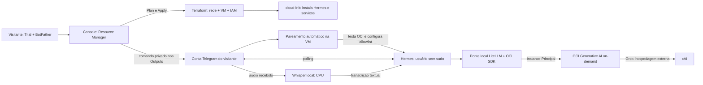

# Arquitetura — execução pelo OCI Resource Manager



O visitante não executa Terraform no notebook ou Cloud Shell. A Stack recebe
tenancy/região da Console; o Terraform valida a subscrição READY em ORD/GRU e cria um
compartment para a demonstração. A Stack fica no root ou em outro compartment
administrativo existente, fora do compartment que ela removerá.

O provider padrão usa a região escolhida para rede/Compute e descoberta de
imagens/ADs. `oci.home` usa a home region detectada em region subscriptions
para compartment, dynamic group e policy. Esses recursos IAM são globais;
a home region pode ser diferente de ORD/GRU. Nenhuma credencial extra é solicitada.

## Responsabilidades

| Componente | Responsabilidade |
|---|---|
| `schema.yaml` | Formulário Console, campo de senha, aceite de risco e Outputs copiáveis |
| Terraform OCI + random + TLS | Compartment, rede, VM, IAM, código privado de vínculo, cloud-init e par SSH opcional |
| `bootstrap.sh` | Instalar Hermes core e Telegram, dependências da ponte e serviços |
| `activate.py` | Validar bot, aguardar código em DM, identificar dono, testar OCI e ativar |
| `configure.py` | Configuração Hermes, chave local da ponte, `.env`, allowlist e gateway |
| `bridge.py` | Traduzir Chat Completions/tool calling/streaming com LiteLLM e assinatura OCI |
| `smoke.py` | Verificar inferência e ciclo completo de tool call + tool result |

## Identidade e segredos

A VM é a única integrante de seu dynamic group. Terraform cria o DG e a policy
na raiz da tenancy pelo provider da home region. A policy permite apenas
`use generative-ai-chat` no compartment do stand. Desde 1.3.3, em Chicago
autoriza todos os modelos de chat com `request.region = 'ORD'`; em GRU, exige
`ALL {request.region = 'GRU', target.model.id = 'meta.llama-3.3-70b-instruct'}`.
Essa ampliação em ORD foi solicitada para trocar modelos sem reeditar IAM:
a identidade pode consumir outros modelos de chat, inclusive de custo maior,
mas o Hermes continua usando apenas o modelo configurado, sem fallback.
Não concede embeddings, rerank, administração ou aumento de quota. Não há chave de
usuário OCI, API key OpenAI-compatible, Project, cluster dedicado ou acesso
administrativo OCI concedido ao agente. O SDK renova sua identidade temporária.

Para eliminar comandos de finalização, o token Telegram é um input sensível
do Terraform. **Está no state, planos/variáveis e cloud-init da instância.**
O schema pede confirmação explícita dessa escolha. Não é uma solução de
secret management para produção. Limite acesso a Stack, jobs/state e VM;
base64/gzip é codificação/compressão, não criptografia.

Desde 1.4.0, `generate_ssh_key` opt-in cria `tls_private_key.ssh[0]` com RSA 4096
(provider TLS 4.3.0 fixado). Exige `acknowledge_ssh_private_key_in_state` e
rejeita chave própria simultânea. A privada fica no state/saída sensível PEM;
somente `public_key_openssh` é inserida em `metadata.ssh_authorized_keys`.
Não usa `remote-exec`, não grava a privada no cloud-init/VM e não envia ao bot.
Não há arquivo privado no pacote GitHub. Cada state gera sua chave e a mantém
entre Applies; CIDR não é gatilho de rotação. Para fechar rede, preserve a chave
e esvazie somente CIDR. Mudar metadados não garante rotação/revogação no SO.
Históricos de state/jobs podem reter segredos após Destroy; a cópia local do
participante deve ser protegida e não é apagada pelo Terraform.

O comando de pareamento é output sensível e deve ser revelado somente ao dono.
O código é aleatório e uma mensagem privada precisa reproduzi-lo exatamente;
o ID do remetente é salvo na allowlist. Webhooks existentes não são apagados.

## Instalação mínima e versões

- Hermes oficial `v2026.7.7.2`, commit verificado
  `9de9c25f620ff7f1ce0fd5457d596052d5159596`; não é um fork.
- `uv 0.12.12`, Python 3.11, core com `uv sync --frozen --no-dev --extra voice`, Telegram
  `python-telegram-bot[webhooks]==22.6`, sem navegador ou canais extras.
- Ponte em virtualenv separada: LiteLLM `1.100.1`, OCI SDK `2.185.2`, FastAPI
  `0.141.1`, Uvicorn `0.52.4`. Transitivas em `requirements.lock` (versões
  fixadas, não hashes de cada wheel); Hermes usa seu lock upstream.
- Terraform >= 1.5; OCI provider `8.21.0`, random `3.7.2`. Tests mock exigem
  >= 1.7 e são apenas para mantenedores.
- User-data comprimido com `base64gzip`; validação abaixo de 30 KB codificados.
  A branch `stand-resource-manager` contém somente o diretório Terraform.

## Arquivos na VM

```text
/etc/hermes-stand.json                 região/compartment/modelo, sem segredo
/etc/hermes-stand-secrets.json         token/código, root:root 0600
/opt/hermes-stand/agent/               Hermes + .venv, propriedade root
/opt/hermes-stand/bridge-venv/          dependências da ponte
/var/lib/hermes-stand/binding.json     identidade do dono, root 0600
/var/lib/hermes-stand/ready.json       testes OCI e ativação concluídos
/var/lib/hermes/.hermes/config.yaml   configuração do agente
/var/lib/hermes/.hermes/.env          token Telegram + chave local da ponte, 0600
/var/lib/hermes/.hermes/bridge.key     chave LOCAL (não OCI), 0600
/var/lib/hermes/workspace/            arquivos do visitante
/var/log/hermes-stand-bootstrap.log   progresso da instalação, sem imprimir token
```

Além do arquivo de configuração, cloud-init guarda cópias do user-data em seus
diretórios e a API Compute mantém os metadados. Não compartilhe esses arquivos.

Serviços: `hermes-oci-bridge`, `hermes-gateway` e `hermes-stand-activate`.
O ativador é administrativo e root; o agente e a ponte usam o usuário `hermes`
sem sudo. O ativador termina com sucesso após configurar, e pode aparecer
inativo normalmente; gateway e ponte continuam ativos e iniciam no boot.

## Limitações e alterações

Desde 1.2.2, `network-preflight.sh` é carregado pelo bootstrap antes de instalar
pacotes. A instalação via módulo de pacotes do cloud-init foi removida porque
ela rodava antes de `runcmd`, sem a verificação DNS. Se houver falha de resolução,
o script reaplica o DNS do NetworkManager sem reiniciar conexões; os retries
são limitados e não mudam a região, o DHCP ou a política de rede.

Desde 1.2.1, `RefreshingOCISigner` adapta a chamada `do_request_sign` do
LiteLLM à interface `__call__` do SDK OCI, que verifica a renovação do token.
Renovação e assinatura são serializadas por lock, sem recriar a identidade
a cada inferência. O SDK continua responsável pelo cache e validade do token.
O adaptador SSE síncrono preserva o enquadramento do LiteLLM e encerra no
marcador `[DONE]`, em vez de tentar interpretá-lo como JSON de resposta OCI.
Esses ajustes são locais à ponte e testados com a versão fixada do LiteLLM.

Desde 1.2.3, a ponte mantém o ID de cada ferramenta por índice de chamada e
choice durante uma resposta: o adaptador OCI fixado gerava IDs sintéticos
diferentes para fragmentos de argumentos sem ID. O nome é emitido uma vez,
os argumentos continuam como deltas, e `stop` com ferramentas vira
`tool_calls`. Um `length` real nunca é convertido em sucesso. A mudança de
nome de função no mesmo índice encerra o stream com erro, sem executar JSON
parcial. O teste de ativação verifica ferramenta e retorno com e sem streaming
(quatro chamadas curtas de inferência por tentativa, sujeitas a consumo).

- Sem serviço web público. Por padrão não há entrada TCP; apenas ICMP de MTU.
  Chave pública gerada ou fornecida + CIDR `/32` habilitam SSH administrativo opcional.
  A chave pode ser instalada com CIDR vazio, mantendo SSH fechado.
  Para o evento, `0.0.0.0/0` é permitido somente com `acknowledge_public_ssh = true`;
  expõe apenas TCP/22 a qualquer IPv4 e continua exigindo chave pública.
  Não há expiração automática: restringir/fechar novamente exige Plan/Apply.
- Disponibilidade de Compute, acesso a GenAI no Trial, quotas e propagação
  IAM só podem ser comprovados com implantação real na conta.
- O teste OCI é repetido enquanto IAM não está pronto. Após uma falha, systemd
  retoma em 60 segundos. Não há desligamento financeiro automático: o visitante
  deve usar Destroy se não quiser continuar aguardando/consumindo créditos.
- Modelo padrão: Grok 4.3 via OCI ORD, hospedado externamente pela xAI; Grok 4.6 opcional.
  Llama 3.3 70B é alternativa explícita para ORD/GRU. Sem fallback entre regiões, provedores,
  modelos, APIs comerciais ou infraestrutura dedicada.
- O limite de 120 chamadas/hora é em memória, reinicia com a ponte e não limita
  uso direto da identidade OCI; não é orçamento nem hard cap financeiro.
- Conversação final e qualidade do uso de ferramentas precisam de teste no
  Telegram. `/healthz` comprova apenas processo em execução, não inferência.
- Mudanças de token/código de bootstrap marcam a VM para substituição via
  `terraform_data.bootstrap_revision`; cloud-init não é reexecutado só porque
  metadados mudaram. Revise Plan e faça backup antes de Apply com replacement.
- Imagem mais recente não substitui sozinha uma VM existente (`ignore_changes`).
  Alterar shape/AD ainda pode substituir a VM; confira o Plan.

## Referências técnicas

Consultadas em 10/09/2026:

- [Deploy to Oracle Cloud — Oracle](https://docs.oracle.com/en-us/iaas/Content/ResourceManager/Tasks/deploybutton.htm)
- [Schema, campos e outputs sensíveis — Oracle](https://docs.oracle.com/en-us/iaas/Content/ResourceManager/Concepts/terraformconfigresourcemanager_topic-schema.htm)
- [Segurança Resource Manager — Oracle](https://docs.oracle.com/en-us/iaas/Content/Security/Reference/resourcemanager_security.htm)
- [Instance Principals — Oracle](https://docs.oracle.com/en-us/iaas/Content/Identity/Tasks/callingservicesfrominstances.htm)
- [Condição request.region — Oracle](https://docs.oracle.com/en-us/iaas/Content/Identity/policyreference/policyreference_topic-General_Variables_for_All_Requests.htm)
- [Permissões de Chat — Oracle](https://docs.oracle.com/en-us/iaas/Content/generative-ai/chat-permissions.htm)
- [Modelos por região — Oracle](https://docs.oracle.com/en-us/iaas/Content/generative-ai/model-endpoint-regions.htm)
- [Grok 4.6 — Oracle](https://docs.oracle.com/en-us/iaas/Content/generative-ai/xai-grok-4-6.htm)
- [Grok 4.3 — Oracle](https://docs.oracle.com/en-us/iaas/Content/generative-ai/xai-grok-4-3.htm)
- [Whisper local — projeto faster-whisper](https://github.com/SYSTRAN/faster-whisper)

## Entrada de áudio e saída textual — 1.3.0

`prepare_audio.py` baixa uma revisão fixa do Whisper base e verifica carregamento
CPU/int8 antes da ativação. Pesos ficam na VM, fora do pacote Terraform.
`stt.provider=local` é explícito: no Hermes fixado, indisponibilidade local não
aciona fallback pago. Português é configurado; a opção STT pode ser desligada.
`gateway_text_only.py` inicia o Hermes com duas guardas de TTS automático e
carregamento STT local-only/CPU. Preferências antigas e `/voice on` não geram
respostas faladas. A ferramenta `tts` também está desabilitada. Essas guardas
são específicas do release Hermes fixado e têm teste de contrato upstream.
Não há API STT paga ou GPU provisionada. CPU/RAM/armazenamento da VM e LLM
continuam sujeitos a consumo. O arquivo de áudio pode ficar no cache do Hermes;
histórico/transcrições requerem os mesmos cuidados de privacidade do chat.

## Controle de HTTP 429 — 1.3.1

A ponte serializa a abertura de chamadas OCI e compartilha cooldown. Apenas
429 antes da entrega do stream permite um retry, respeitando Retry-After ou
65 s por padrão, com orçamento de abertura/fila de 100 s. Os retries contam
nas 120 chamadas/h; os limites OCI são independentes. Nenhum aumento de quota,
troca de modelo, tier prioritário ou mudança IAM é feito automaticamente.
Os arquivos de instalação usam `encoding: gz+b64` nativo do cloud-init,
mantendo o teto de 30.000 caracteres de user-data sem remover validações.
- [OCI Signer e tool calling — LiteLLM](https://docs.litellm.ai/docs/providers/oci)
- [Telegram Bot API](https://core.telegram.org/bots/api#getupdates)
